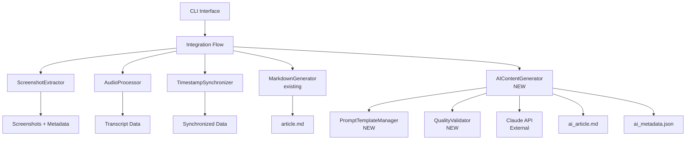
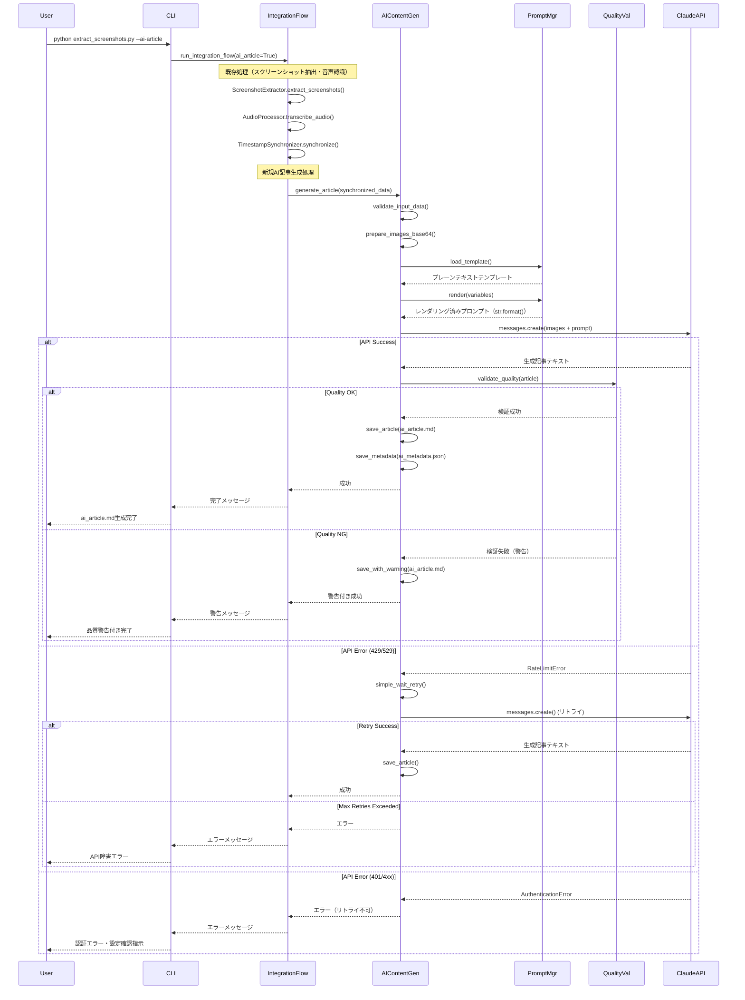
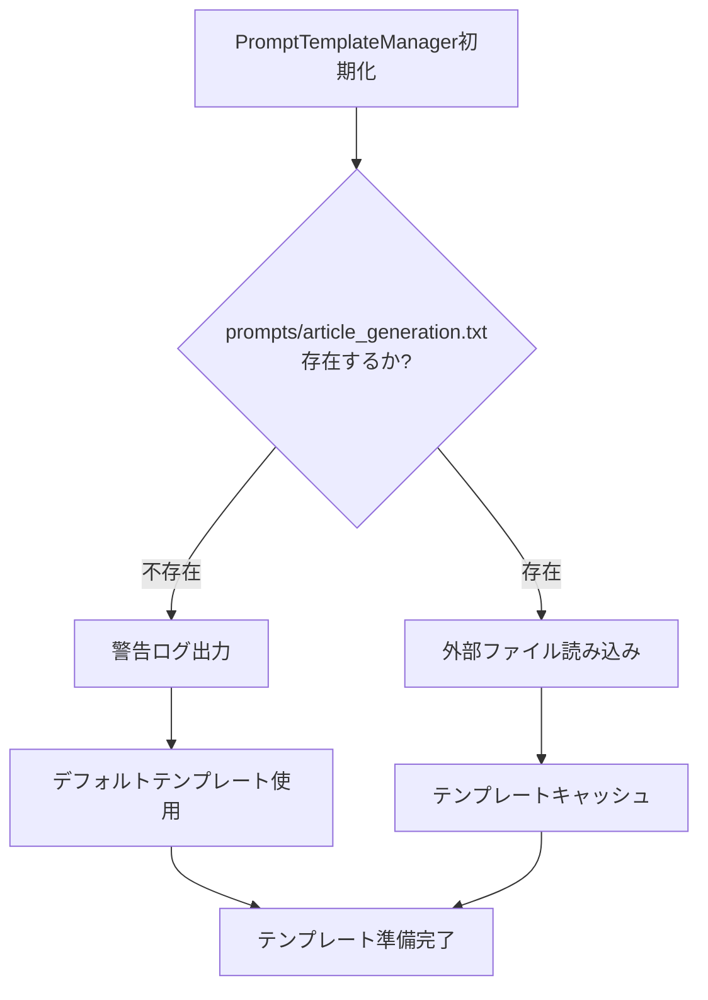
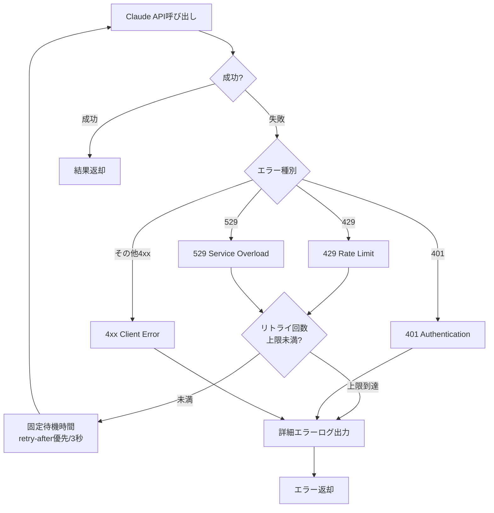
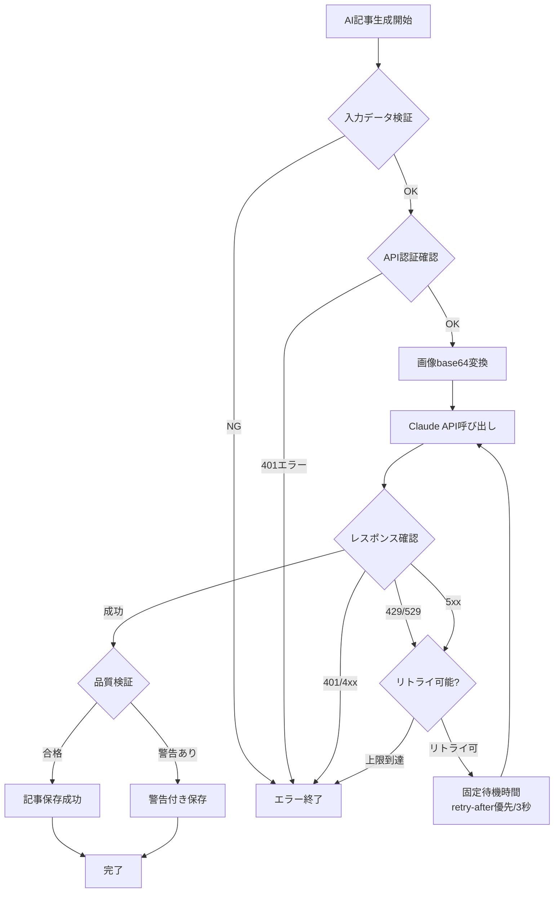

# Design Document: AI Content Generation

## Overview

本機能は、既存のスクリーンショット抽出・音声認識パイプラインに、マルチモーダルAI（Claude API）を統合し、高品質なアプリ紹介記事を自動生成する機能を追加します。現状の単純なMarkdown記事生成（画像とテキストの羅列）から、AIによる視覚情報と音声解説の統合分析を通じて、読者の興味を引く魅力的な記事を生成します。

**Purpose**: 動画から抽出されたスクリーンショット画像、メタデータ、音声文字起こしデータをマルチモーダルAIに入力し、読者が「使ってみたい」と思える高品質でワクワクするアプリ紹介記事を自動生成する。

**Users**: アプリ開発者、マーケティング担当者、技術ライターが、アプリデモ動画から即座に公開可能なブログ記事や紹介コンテンツを生成する用途で利用する。

**Impact**: 既存のMarkdownGenerator（v2.0.0）による単純な羅列記事から、AIによる高度な分析・ストーリー構成を持つ記事生成へ進化させる。既存の`--markdown`オプションはそのまま維持し、新規`--ai-article`オプションでAI生成記事を提供する。

### Goals

- マルチモーダルAI（Claude API）との統合により、画像とテキストを組み合わせた高品質記事を自動生成
- プロンプトテンプレートの外部管理による柔軟なカスタマイズ性の確保
- 生成記事の品質自動検証とメタデータ記録
- 既存パイプラインへのシームレスな統合（`--ai-article`オプション）
- エラーハンドリングとフォールバック機能による安定運用

### Non-Goals

- リアルタイム記事生成（バッチ処理として設計）
- 複数AIモデルの同時サポート（初期リリースはClaude APIのみ）
- 記事の手動編集機能（生成結果はファイルとして保存し、外部エディタで編集）
- 画像最適化やリサイズ処理（既存のScreenshotExtractorの責務）
- WebベースのUI（CLIツールとして設計）

## Architecture

### Existing Architecture Analysis

**Current Architecture Patterns**:
- シングルファイル・クラスベース設計（`extract_screenshots.py`）
- 5ステージ処理パイプライン（Scene Detection → Stable Frame → UI Analysis → Scoring → Selection）
- 遅延初期化パターン（EasyOCR、Whisperモデルのグローバルキャッシュ）
- クラス分離による責任境界（ScreenshotExtractor, AudioProcessor, MarkdownGenerator, TimestampSynchronizer）

**Domain Boundaries to Respect**:
- **Video Processing Domain**: ScreenshotExtractorが所有（変更なし）
- **Audio Processing Domain**: AudioProcessorが所有（変更なし）
- **Content Generation Domain**: MarkdownGeneratorが所有（既存）、AIContentGeneratorを追加（新規）
- **Synchronization Domain**: TimestampSynchronizerが所有（変更なし）

**Integration Points**:
- `run_integration_flow()`: 統合フロー管理関数（新規オプション`--ai-article`を追加）
- `create_argument_parser()`: コマンドライン引数パーサー（新規引数を追加）
- Output directory: `./output/` （既存の命名規則に従い`ai_article.md`を出力）

**Technical Debt Addressed**:
- 現状のMarkdownGenerator（v2.0.0）は単純な羅列のみで訴求力が低い → AIによる高度な分析と記事構成で解決
- プロンプトのハードコード問題 → 外部テンプレートファイルによる管理で解決

### High-Level Architecture



**Architecture Integration**:
- **Existing Patterns Preserved**: クラスベース設計、遅延初期化、ステージ処理、CLI統合
- **New Components Rationale**:
  - `AIContentGenerator`: Claude API統合と記事生成ロジックをカプセル化（単一責任の原則）
  - `PromptTemplateManager`: プロンプト管理の分離（設定と処理の分離）
  - `QualityValidator`: 品質検証ロジックの独立（テスト容易性と再利用性）
- **Technology Alignment**: Python 3.11+、型ヒント、既存の依存ライブラリとの整合性
- **Steering Compliance**: シングルファイル構造の維持、CLI第一主義、ローカル実行優先（API呼び出しはオプトイン）

### Technology Alignment and New Dependencies

**Existing Technology Stack**:
- Python 3.11+、OpenCV、Pillow、imagehash、EasyOCR、OpenAI Whisper
- CLIツール（argparse）、JSON/Markdown出力
- macOS（Apple Silicon最適化）

**New Dependencies**:
- **anthropic** (v0.34.0+): Claude API公式Python SDK
  - Rationale: 公式SDK使用で安定性とメンテナンス性を確保
  - API互換性: Messages API（`messages.create`）をサポート
  - 画像送信: base64エンコード対応（`type: "image"`, `source.type: "base64"`）

**Configuration Management**:
- 環境変数: `ANTHROPIC_API_KEY`（APIキー管理、セキュリティベストプラクティス）
- 外部ファイル: `prompts/article_with_audio.txt`, `prompts/article_without_audio.txt`（プレーンテキストテンプレート、str.format()で変数置換）
- コマンドライン引数: `--ai-article`, `--app-name`, `--ai-model`, `--output-format`

### Key Design Decisions

#### Decision 1: Claude API選択とマルチモーダル統合

**Decision**: Anthropic Claude API（Claude 3.5 Sonnet以降）をマルチモーダルAIとして採用

**Context**:
- 要件1「マルチモーダルAI統合」では、画像とテキストを同時に処理できるAIが必要
- スクリーンショット画像（最大20枚）、メタデータJSON、音声文字起こしテキストを統合して高品質記事を生成

**Alternatives**:
1. OpenAI GPT-4 Vision: 画像+テキスト対応、料金体系が異なる、API制限が異なる
2. Google Gemini Pro Vision: マルチモーダル対応、Python SDKの成熟度
3. ローカルLLM（LLaVA等）: プライバシー保護、性能制約、セットアップ複雑

**Selected Approach**:
- Claude 3.5 Sonnet（`claude-3-5-sonnet-20241022`）を使用
- Python SDK（`anthropic`）でMessages APIを呼び出し
- 画像はbase64エンコードしてcontent blocksに含める（最大20画像、3.75MB/8000px制限）
- リクエスト構造:
```python
messages=[{
    "role": "user",
    "content": [
        {"type": "image", "source": {"type": "base64", "media_type": "image/png", "data": "..."}},
        # ... 複数画像
        {"type": "text", "text": "プロンプトテキスト"}
    ]
}]
```

**Rationale**:
- Claude 3.5 Sonnetは2025年現在、画像理解とテキスト生成の品質が高い
- 公式Python SDKが安定しており、型ヒント・エラーハンドリングが充実
- トークン単価とレート制限のバランスが良い
- 日本語対応が優れている（要件の音声文字起こしは日本語）

**Trade-offs**:
- **Gain**: 高品質な記事生成、公式SDK、安定性、日本語対応
- **Sacrifice**: 外部API依存（ネットワーク必須）、APIコスト、レート制限への対応が必要

#### Decision 2: プロンプトテンプレートの外部管理と2つのテンプレートファイル方式

**Decision**: プロンプトテンプレートを外部ファイルで管理し、音声あり/なし用に2つのテンプレートファイル（`prompts/article_with_audio.txt`、`prompts/article_without_audio.txt`）を使用

**Context**:
- 要件2「AIプロンプト設計」および要件6「設定とカスタマイズ」では、プロンプトのカスタマイズ性が求められる
- 開発者でないユーザーがコード変更なしでプロンプトを試行錯誤できるようにする必要がある
- 音声文字起こしの有無でプロンプトの内容が大きく異なる（画像のみ vs 画像+音声解説）

**Alternatives**:
1. ハードコード: コード内に直接記述、シンプルだが変更が困難
2. 単一テンプレート + Pythonコード内条件分岐: プロンプトロジックが分散し、カスタマイズ性低下
3. 2つのテンプレートファイル: シンプルで明確、カスタマイズ容易
4. Jinja2等のテンプレートエンジン: 強力だが本要件には過剰

**Selected Approach**:
- `prompts/article_with_audio.txt`: 音声文字起こしがある場合のテンプレート
- `prompts/article_without_audio.txt`: 音声文字起こしがない場合のテンプレート
- 変数置換: `{app_name}`, `{total_screenshots}`など最小限の変数のみ`str.format()`で処理
- テンプレート選択: Pythonコード内で音声の有無を判定し、適切なテンプレートファイルを選択
- デフォルトテンプレート: ファイルが存在しない場合はコード内のフォールバックを使用

```python
# prompts/article_with_audio.txt の例
あなたは{app_name}の魅力を伝える技術ライターです。

以下の{total_screenshots}枚のスクリーンショット画像を分析してください。
各スクリーンショットには音声解説のテキストが付与されています。画像の視覚情報と音声解説を統合して、アプリの機能と価値提案を分析してください。

タスク:
1. 各画像のUI特徴と機能を分析
2. 音声解説から開発者の意図やアプリの価値提案を抽出
3. 読者がワクワクする文章で、ストーリー性のある記事を構成

フォーマット: Markdown（H1タイトル、H2セクション、画像リンク）
```

```python
# prompts/article_without_audio.txt の例
あなたは{app_name}の魅力を伝える技術ライターです。

以下の{total_screenshots}枚のスクリーンショット画像を分析してください。
音声解説はありません。画像の視覚情報のみから、UIの特徴と機能を推測して記事を作成してください。

タスク:
1. 各画像のUI要素と機能を分析
2. 画像から機能の目的を推測
3. 読者がワクワクする文章で、ストーリー性のある記事を構成

フォーマット: Markdown（H1タイトル、H2セクション、画像リンク）
```

```python
# Pythonコード内での処理
if transcript_available:
    template_name = "article_with_audio.txt"
else:
    template_name = "article_without_audio.txt"

template = prompt_manager.load_template(template_name)
prompt = template.format(
    app_name=app_name,
    total_screenshots=len(screenshots)
)
```

**Rationale**:
- 2つのテンプレートファイルにより、プロンプトロジックが完全にテンプレート内に集約される
- ユーザーはテンプレートファイルのみを編集すればよく、Pythonコードの理解不要
- 音声あり/なしの違いが明確で、保守性が高い
- Pythonネイティブの機能のみで実現可能、新規依存ライブラリ不要
- 既存のプロジェクト原則（軽量依存、シンプル設計）と整合

**Trade-offs**:
- **Gain**: 明確な責任分離、カスタマイズ容易性、保守性、既存パターンとの整合性
- **Sacrifice**: テンプレートファイルが2つになる（ただし管理コストは低い）

#### Decision 3: シンプルなエラーハンドリング戦略

**Decision**: Claude APIエラー（429, 529）に対してシンプルなリトライ戦略を実装（最大2-3回リトライ、固定待機時間）

**Context**:
- 要件5「エラーハンドリングとフォールバック」では、API障害やレート制限への適切な対応が求められる
- 単一ユーザーのCLIツールであり、大規模分散システム向けの高度なエラーハンドリングは不要
- ユーザーは通常1回の記事生成を行うため、複雑なCircuit Breakerの実用的価値は低い

**Alternatives**:
1. 即座にエラー終了: シンプルだが、一時的な障害に脆弱
2. シンプルなリトライ: 固定回数・固定待機時間、CLIツールに適切
3. Exponential Backoff with Jitter: 大規模システム向け、CLIツールには過剰
4. Circuit Breaker: 大規模分散システム向け、単一ユーザーCLIには過剰

**Selected Approach**:
- **シンプルなリトライ**: 429/529エラーで最大2-3回リトライ
- **Retry-After Header優先**: APIレスポンスヘッダーの指示に従う（存在する場合）
- **固定待機時間**: retry-afterヘッダーがない場合は3秒待機
- **エラー分類**:
  - 429（Rate Limit）: リトライ対象（最大3回）
  - 529（Service Overload）: リトライ対象（最大3回）
  - 401（Authentication）: リトライ不可、即座にエラー終了
  - 4xx（その他）: リトライ不可、エラー詳細をログ出力

```python
def call_api_with_retry(self, request_data: Dict, max_retries: int = 3) -> Dict:
    """シンプルなリトライ戦略でClaude APIを呼び出し"""
    for attempt in range(max_retries):
        try:
            response = self.client.messages.create(**request_data)
            return response
        except anthropic.RateLimitError as e:
            if attempt == max_retries - 1:
                raise
            # retry-afterヘッダーを優先、なければ3秒待機
            retry_after = e.response.headers.get('retry-after', 3)
            print(f"レート制限到達。{retry_after}秒後にリトライ（{attempt + 1}/{max_retries}）")
            time.sleep(float(retry_after))
        except anthropic.ServiceUnavailableError as e:
            # 529エラー: サーバー過負荷
            if attempt == max_retries - 1:
                raise
            print(f"APIサーバー過負荷。3秒後にリトライ（{attempt + 1}/{max_retries}）")
            time.sleep(3)
        except anthropic.AuthenticationError:
            # 認証エラーはリトライ不可
            raise
```

**Rationale**:
- CLIツールのユースケースでは、ユーザーはエラー時に再実行することが多い
- シンプルなリトライ戦略で十分な障害対応が可能
- retry-afterヘッダーを尊重することでAPI利用規約を遵守
- 既存のシンプルなエラーハンドリングパターン（AudioProcessor、MarkdownGenerator）と整合

**Trade-offs**:
- **Gain**: シンプルさ、実装・テスト容易性、既存パターンとの整合性、十分な障害対応
- **Sacrifice**: 高度な障害対応機能（本要件では不要）

## System Flows

### AI記事生成処理フロー



### プロンプトテンプレート読み込みフロー



### エラーハンドリングフロー



## Requirements Traceability

| 要件 | 要件概要 | 実現コンポーネント | インターフェース | フロー参照 |
|------|----------|-------------------|-----------------|----------|
| 1.1-1.4 | マルチモーダルAI統合 | AIContentGenerator | `generate_article()`, `prepare_images_base64()` | AI記事生成処理フロー |
| 1.5 | 入力データエラー検証 | AIContentGenerator | `validate_input_data()` | AI記事生成処理フロー（validate_input_data） |
| 2.1-2.6 | AIプロンプト設計 | PromptTemplateManager | `load_template()`, `render()` | プロンプトテンプレート読み込みフロー |
| 3.1-3.6 | 高品質記事生成 | AIContentGenerator + QualityValidator | `generate_article()`, `validate_quality()` | AI記事生成処理フロー（品質検証分岐） |
| 4.1-4.5 | 既存パイプライン統合 | run_integration_flow() + CLI | `--ai-article`オプション、統合フロー管理 | AI記事生成処理フロー（IntegrationFlow） |
| 5.1-5.5 | エラーハンドリング | AIContentGenerator | `call_api_with_retry()`, 環境変数管理 | エラーハンドリングフロー |
| 6.1-6.5 | 設定とカスタマイズ | PromptTemplateManager + CLI | 外部ファイル読み込み、コマンドライン引数 | プロンプトテンプレート読み込みフロー |
| 7.1-7.5 | 出力品質の検証 | QualityValidator | `validate_structure()`, `save_metadata()` | AI記事生成処理フロー（品質検証） |

## Components and Interfaces

### Content Generation Domain

#### AIContentGenerator

**Responsibility & Boundaries**:
- **Primary Responsibility**: Claude APIを呼び出してマルチモーダルAI記事を生成し、結果を保存する
- **Domain Boundary**: Content Generation Domain（コンテンツ生成領域）
- **Data Ownership**: 生成されたMarkdownコンテンツ、APIリクエスト/レスポンスデータ、生成メタデータ
- **Transaction Boundary**: 単一記事生成処理（API呼び出し～保存までがアトミック）

**Dependencies**:
- **Inbound**: run_integration_flow()（統合フロー管理関数）
- **Outbound**:
  - PromptTemplateManager（プロンプトテンプレート管理）
  - QualityValidator（品質検証）
  - Claude API（外部AIサービス）
- **External**:
  - anthropic Python SDK（Claude API公式ライブラリ）
  - Pillow（画像読み込み・base64エンコード）
  - 環境変数`ANTHROPIC_API_KEY`

**External Dependencies Investigation**:
- **anthropic SDK**:
  - バージョン: v0.34.0以降（Messages API対応）
  - API署名: `client.messages.create(model, max_tokens, messages)`
  - 認証: API Key via `ANTHROPIC_API_KEY`環境変数または`Anthropic(api_key="...")`
  - レート制限: 応答ヘッダー`anthropic-ratelimit-*`、429エラー時に`retry-after`ヘッダー
  - 画像制限: 最大20画像/リクエスト、各3.75MB・8000px以下
  - 対応形式: PNG, JPEG, GIF, WebP
  - エラー型: `anthropic.RateLimitError`, `anthropic.APIError`, `anthropic.AuthenticationError`
- **Claude API**:
  - モデル: `claude-3-5-sonnet-20241022`（推奨）、`claude-sonnet-4-20250514`（最新）
  - コスト: Input $3/MTok, Output $15/MTok（2025年現在の概算）
  - レート制限: トークンバケット方式、層別制限（Free/Pro/Enterprise）
  - ベストプラクティス: 画像をプロンプトより前に配置、複数画像の場合は関連性を明示

**Contract Definition**

**Service Interface**:
```python
from typing import List, Dict, Optional
from pathlib import Path

class AIContentGenerator:
    """
    マルチモーダルAI（Claude API）を使用して高品質なアプリ紹介記事を生成するクラス
    """

    def __init__(self,
                 output_dir: str,
                 api_key: Optional[str] = None,
                 model: str = "claude-3-5-sonnet-20241022",
                 max_tokens: int = 4000) -> None:
        """
        Args:
            output_dir: 出力ディレクトリパス
            api_key: Claude APIキー（Noneの場合は環境変数から取得）
            model: 使用するClaudeモデル名
            max_tokens: 最大出力トークン数

        Raises:
            ValueError: APIキーが未設定の場合
        """
        ...

    def generate_article(self,
                        synchronized_data: List[Dict],
                        app_name: str = "アプリ",
                        output_format: str = "markdown") -> Dict[str, any]:
        """
        スクリーンショット・メタデータ・音声文字起こしから高品質記事を生成

        Args:
            synchronized_data: タイムスタンプ同期済みデータ
                [{"screenshot": {...}, "transcript": {...}, "matched": bool}, ...]
            app_name: アプリ名（プロンプトテンプレート変数）
            output_format: 出力形式（"markdown" or "html"）

        Returns:
            {
                "content": str,  # 生成された記事テキスト
                "metadata": {
                    "model": str,
                    "prompt_version": str,
                    "generated_at": str,
                    "total_screenshots": int,
                    "transcript_available": bool,
                    "quality_score": float
                }
            }

        Raises:
            ValueError: 入力データが不正な場合
            anthropic.APIError: API呼び出し失敗（リトライ後）
        """
        ...

    def validate_input_data(self, synchronized_data: List[Dict]) -> bool:
        """
        入力データの妥当性を検証

        Args:
            synchronized_data: 検証対象データ

        Returns:
            検証成功ならTrue

        Raises:
            ValueError: データ不正時に具体的なエラーメッセージ
        """
        ...

    def prepare_images_base64(self, screenshot_paths: List[Path]) -> List[Dict]:
        """
        スクリーンショット画像をbase64エンコードしてClaudeAPIリクエスト形式に変換

        Args:
            screenshot_paths: 画像ファイルパスのリスト

        Returns:
            [
                {
                    "type": "image",
                    "source": {
                        "type": "base64",
                        "media_type": "image/png",
                        "data": "base64文字列"
                    }
                },
                ...
            ]

        Raises:
            FileNotFoundError: 画像ファイルが存在しない場合
            ValueError: 画像が制限超過（3.75MB, 8000px）の場合
        """
        ...

    def call_api_with_retry(self,
                           request_data: Dict,
                           max_retries: int = 3) -> any:
        """
        シンプルなリトライ戦略でClaude APIを呼び出し

        Args:
            request_data: APIリクエストパラメータ
            max_retries: 最大リトライ回数（デフォルト: 3）

        Returns:
            Claude APIレスポンス

        Raises:
            anthropic.RateLimitError: レート制限超過（リトライ上限到達）
            anthropic.AuthenticationError: 認証エラー（リトライ不可）
            anthropic.APIError: その他のAPIエラー
        """
        ...

    def save_article(self, content: str, metadata: Dict) -> Path:
        """
        生成記事とメタデータをファイルに保存

        Args:
            content: 記事テキスト
            metadata: 生成メタデータ

        Returns:
            保存先ファイルパス（ai_article.md）
        """
        ...
```

**Preconditions**:
- `ANTHROPIC_API_KEY`環境変数が設定されている、またはapi_key引数で指定
- synchronized_dataが空でない
- スクリーンショット画像ファイルが実在する
- 画像ファイルがClaude API制限内（3.75MB以下、8000px以下）

**Postconditions**:
- 成功時: `ai_article.md`と`ai_metadata.json`がoutput_dirに保存される
- エラー時: 例外を投げ、部分的なファイルは残さない（アトミック性）
- リトライ時: 最大3回まで自動リトライ、ログ出力

**Invariants**:
- APIキーは常に環境変数または初期化時の引数から取得（ハードコード禁止）
- 1リクエストあたりの画像数は20枚以下
- 生成記事はMarkdown形式（H1, H2, 画像リンク）

#### PromptTemplateManager

**Responsibility & Boundaries**:
- **Primary Responsibility**: プロンプトテンプレートの読み込み、検証、レンダリング
- **Domain Boundary**: Configuration Management（設定管理領域）
- **Data Ownership**: プロンプトテンプレートファイル、変数置換ロジック
- **Transaction Boundary**: テンプレート1回の読み込み・レンダリング

**Dependencies**:
- **Inbound**: AIContentGenerator
- **Outbound**: ファイルシステム（`prompts/article_generation.txt`）
- **External**: なし（Pythonネイティブ機能のみ）

**Contract Definition**

**Service Interface**:
```python
from typing import Dict, Optional
from pathlib import Path

class PromptTemplateManager:
    """
    プロンプトテンプレートを管理し、str.format()で変数置換を行う
    """

    def __init__(self, template_dir: str = "prompts") -> None:
        """
        Args:
            template_dir: テンプレートファイル格納ディレクトリ
        """
        ...

    def load_template(self, template_name: str) -> str:
        """
        外部ファイルからテンプレートを読み込み

        Args:
            template_name: テンプレートファイル名
                - "article_with_audio.txt": 音声文字起こしがある場合
                - "article_without_audio.txt": 音声文字起こしがない場合

        Returns:
            テンプレート文字列（プレーンテキスト、{変数名}形式）

        Raises:
            FileNotFoundError: ファイルが存在しない場合（警告ログ後デフォルト返却）
        """
        ...

    def render(self, template: str, variables: Dict[str, any]) -> str:
        """
        テンプレートに変数を適用してレンダリング（str.format()使用）

        Args:
            template: プレーンテキストテンプレート文字列
            variables: 置換変数辞書
                {
                    "app_name": str,
                    "total_screenshots": int,
                    ...
                }

        Returns:
            レンダリング済みプロンプトテキスト

        Raises:
            KeyError: 必須変数が欠落している場合
        """
        ...

    def get_default_template(self, with_audio: bool = True) -> str:
        """
        デフォルトプロンプトテンプレートを返却（フォールバック用）

        Args:
            with_audio: 音声文字起こしあり用のテンプレートを返すか

        Returns:
            デフォルトテンプレート文字列
        """
        ...
```

**Preconditions**:
- template_dirが存在する（存在しない場合はログ警告）
- variablesに必須変数が含まれる（app_name, total_screenshots）
- template_nameは"article_with_audio.txt"または"article_without_audio.txt"

**Postconditions**:
- レンダリング成功時: 変数が置換された完成プロンプトを返却
- テンプレートファイル不在時: デフォルトテンプレートを使用し警告ログ出力

**Invariants**:
- テンプレートファイルはUTF-8エンコーディング
- 変数置換は厳密（未定義変数はKeyErrorを発生）

#### QualityValidator

**Responsibility & Boundaries**:
- **Primary Responsibility**: 生成された記事の品質を自動検証
- **Domain Boundary**: Quality Assurance（品質保証領域）
- **Data Ownership**: 品質検証ルール、検証結果
- **Transaction Boundary**: 単一記事の品質検証

**Dependencies**:
- **Inbound**: AIContentGenerator
- **Outbound**: なし（独立した検証ロジック）
- **External**: なし

**Contract Definition**

**Service Interface**:
```python
from typing import Dict, List

class QualityValidator:
    """
    生成記事の品質を自動検証するクラス
    """

    def __init__(self,
                 min_chars: int = 500,
                 require_h1: bool = True,
                 require_h2: bool = True,
                 require_images: bool = True) -> None:
        """
        Args:
            min_chars: 最低文字数
            require_h1: H1見出し必須フラグ
            require_h2: H2見出し必須フラグ
            require_images: 画像リンク必須フラグ
        """
        ...

    def validate_quality(self, content: str, screenshot_paths: List[Path]) -> Dict[str, any]:
        """
        Markdown記事の品質を検証

        Args:
            content: 検証対象のMarkdownテキスト
            screenshot_paths: 参照すべき画像パスリスト

        Returns:
            {
                "valid": bool,  # 全検証項目合格ならTrue
                "warnings": List[str],  # 警告メッセージリスト
                "metrics": {
                    "char_count": int,
                    "h1_count": int,
                    "h2_count": int,
                    "image_count": int,
                    "broken_links": List[str]
                }
            }
        """
        ...

    def validate_structure(self, content: str) -> bool:
        """
        Markdown構造の妥当性を検証（H1, H2, 画像リンク）

        Args:
            content: Markdownテキスト

        Returns:
            構造が有効ならTrue
        """
        ...

    def validate_image_links(self, content: str, screenshot_paths: List[Path]) -> List[str]:
        """
        画像リンクの存在確認

        Args:
            content: Markdownテキスト
            screenshot_paths: 実在する画像パス

        Returns:
            壊れたリンクのリスト（空なら全て有効）
        """
        ...
```

**Preconditions**:
- contentがMarkdown形式のテキスト
- screenshot_pathsが有効なPathオブジェクトリスト

**Postconditions**:
- 検証結果を辞書形式で返却（valid, warnings, metrics）
- 検証失敗時も例外を投げず、警告リストに詳細を格納

**Invariants**:
- 検証ルールは初期化時に設定され、実行中は変更されない
- 検証は副作用なし（純粋関数）

### CLI Integration

#### run_integration_flow() 拡張

**Integration Strategy**:
- **Modification Approach**: 既存関数を拡張（新規引数`ai_article`を追加）
- **Backward Compatibility**: 既存の`--markdown`オプションは変更なし、`--ai-article`は独立したオプション
- **Migration Path**: 段階的導入（既存機能は保持、新機能はオプトイン）

**Extended Interface**:
```python
def run_integration_flow(video_path: str,
                         output_dir: str,
                         audio_path: Optional[str],
                         markdown: bool,
                         ai_article: bool,  # NEW
                         app_name: Optional[str] = None,  # NEW
                         ai_model: str = "claude-3-5-sonnet-20241022",  # NEW
                         output_format: str = "markdown",  # NEW
                         model_size: str,
                         threshold: int,
                         interval: float,
                         count: int) -> None:
    """
    統合処理フローを実行（既存機能 + AI記事生成）

    Args:
        video_path: 入力動画ファイルパス
        output_dir: 出力ディレクトリ
        audio_path: 音声ファイルパス（None可）
        markdown: 既存Markdown生成フラグ（MarkdownGenerator使用）
        ai_article: AI記事生成フラグ（AIContentGenerator使用）NEW
        app_name: アプリ名（任意、未指定時は動画ファイル名から推測）NEW
        ai_model: Claude APIモデル名 NEW
        output_format: 出力形式（markdown/html）NEW
        model_size: Whisperモデルサイズ
        threshold: 画面遷移検出の閾値
        interval: 最小時間間隔
        count: 抽出する画像の枚数
    """
    # 既存処理: スクリーンショット抽出
    extractor = ScreenshotExtractor(...)
    metadata = extractor.extract_screenshots()

    # 既存処理: 音声認識
    transcript_data = None
    if audio_path:
        audio_processor = AudioProcessor(...)
        transcript_data = audio_processor.transcribe_audio(...)

    # 既存処理: タイムスタンプ同期
    if audio_path and transcript_data:
        synchronizer = TimestampSynchronizer(...)
        synchronized = synchronizer.synchronize(metadata, transcript_data)
    else:
        synchronized = [{"screenshot": m, "transcript": None, "matched": False} for m in metadata]

    # 既存処理: Markdown生成（従来の羅列形式）
    if markdown:
        md_generator = MarkdownGenerator(...)
        markdown_content = md_generator.generate(synchronized)
        md_generator.save(markdown_content)

    # NEW: AI記事生成
    if ai_article:
        print("\n" + "=" * 60)
        print("  AI Article Generation")
        print("=" * 60)

        ai_generator = AIContentGenerator(
            output_dir=output_dir,
            model=ai_model,
            max_tokens=4000
        )

        try:
            # アプリ名を決定（--app-nameオプション優先、未指定時は動画ファイル名から推測）
            if app_name:
                final_app_name = app_name
            else:
                # 動画ファイル名から拡張子を除去してアプリ名として使用
                final_app_name = Path(video_path).stem
                if not final_app_name or final_app_name.startswith('.'):
                    # ファイル名が無効な場合はデフォルトを使用
                    final_app_name = "アプリ"
                    print(f"⚠️  Warning: 動画ファイル名からアプリ名を推測できませんでした。デフォルト値 '{final_app_name}' を使用します。")

            result = ai_generator.generate_article(
                synchronized_data=synchronized,
                app_name=final_app_name,
                output_format=output_format
            )

            ai_generator.save_article(result["content"], result["metadata"])

            # 品質検証結果表示
            if not result["metadata"].get("quality_valid", True):
                print("⚠️  Warning: 生成記事が品質基準を満たしていない可能性があります")
                for warning in result["metadata"].get("quality_warnings", []):
                    print(f"  - {warning}")

            print(f"\n✓ AI記事生成完了: {output_dir}/ai_article.md")

        except Exception as e:
            print(f"\n✗ AI記事生成エラー: {e}")
            # 既存機能は影響を受けない（フォールスルー）
```

#### CLI Argument Parser 拡張

**Extended Arguments**:
```python
def create_argument_parser() -> argparse.ArgumentParser:
    parser = argparse.ArgumentParser(...)

    # 既存オプション（変更なし）
    parser.add_argument('-i', '--input', required=True, ...)
    parser.add_argument('-o', '--output', default='./output', ...)
    parser.add_argument('--audio', type=str, default=None, ...)
    parser.add_argument('--markdown', action='store_true', ...)  # 既存の羅列形式

    # NEW: AI記事生成オプション
    parser.add_argument('--ai-article', action='store_true',
                       help='AI（Claude API）による高品質記事を生成（任意）')
    parser.add_argument('--app-name', type=str, default=None,
                       help='アプリ名（任意、未指定時は動画ファイル名から推測）')
    parser.add_argument('--ai-model', type=str,
                       default='claude-3-5-sonnet-20241022',
                       choices=['claude-3-5-sonnet-20241022', 'claude-sonnet-4-20250514'],
                       help='使用するClaudeモデル（デフォルト: claude-3-5-sonnet-20241022）')
    parser.add_argument('--output-format', type=str,
                       default='markdown',
                       choices=['markdown', 'html'],
                       help='AI記事の出力形式（デフォルト: markdown）')

    return parser
```

## Data Models

### Domain Model

**Core Concepts**:
- **Aggregates**:
  - ArticleGenerationRequest: 記事生成リクエスト（スクリーンショット群 + メタデータ + 音声文字起こし）
  - GeneratedArticle: 生成された記事（コンテンツ + メタデータ + 品質スコア）
- **Value Objects**:
  - PromptTemplate: プロンプトテンプレート（文字列 + 変数定義）
  - QualityMetrics: 品質メトリクス（文字数、見出し数、画像リンク数）
  - APIConfiguration: API設定（モデル名、最大トークン数、リトライ設定）

**Business Rules & Invariants**:
- 画像は最大20枚まで（Claude API制限）
- 各画像は3.75MB以下、8000px以下
- 生成記事は最低500文字以上（品質基準）
- H1見出しは1つ、H2見出しは2つ以上（構造基準）

### Logical Data Model

#### ArticleGenerationRequest

```python
from typing import List, Dict, Optional
from dataclasses import dataclass

@dataclass
class ScreenshotData:
    """スクリーンショットデータ"""
    file_path: Path
    timestamp: float
    score: float
    ui_elements: List[str]

@dataclass
class TranscriptSegment:
    """音声文字起こしセグメント"""
    text: str
    start_time: float
    end_time: float

@dataclass
class SynchronizedItem:
    """タイムスタンプ同期済みアイテム"""
    screenshot: ScreenshotData
    transcript: Optional[TranscriptSegment]
    matched: bool

@dataclass
class ArticleGenerationRequest:
    """記事生成リクエスト"""
    synchronized_data: List[SynchronizedItem]
    app_name: str
    output_format: str  # "markdown" or "html"
    transcript_available: bool  # True: article_with_audio.txt, False: article_without_audio.txt
```

#### GeneratedArticle

```python
from datetime import datetime
from typing import List, Dict

@dataclass
class QualityMetrics:
    """品質メトリクス"""
    char_count: int
    h1_count: int
    h2_count: int
    image_count: int
    broken_links: List[str]

@dataclass
class ArticleMetadata:
    """記事生成メタデータ"""
    model: str
    prompt_version: str
    generated_at: datetime
    total_screenshots: int
    transcript_available: bool
    quality_valid: bool
    quality_warnings: List[str]
    quality_metrics: QualityMetrics

@dataclass
class GeneratedArticle:
    """生成された記事"""
    content: str  # Markdown or HTML
    metadata: ArticleMetadata
```

### Physical Data Model

#### Output Files

**ai_article.md** (Markdown記事):
```markdown
# {動的に生成されるタイトル}

## {動的に生成されるセクション1}
{説明文...}


{画像に関する説明文...}

## {動的に生成されるセクション2}
...
```

**ai_metadata.json** (生成メタデータ):
```json
{
  "model": "claude-3-5-sonnet-20241022",
  "prompt_version": "1.0.0",
  "generated_at": "2025-10-18T12:34:56Z",
  "total_screenshots": 10,
  "transcript_available": true,
  "quality_valid": true,
  "quality_warnings": [],
  "quality_metrics": {
    "char_count": 1250,
    "h1_count": 1,
    "h2_count": 4,
    "image_count": 10,
    "broken_links": []
  },
  "api_usage": {
    "input_tokens": 15234,
    "output_tokens": 1456,
    "total_cost_usd": 0.068
  }
}
```

**prompts/article_with_audio.txt** (音声文字起こしあり用テンプレート):
```
あなたは{app_name}の魅力を伝える技術ライターです。

以下の{total_screenshots}枚のスクリーンショット画像を分析してください。
各スクリーンショットには音声解説のテキストが付与されています。画像の視覚情報と音声解説を統合して、アプリの機能と価値提案を分析してください。

## タスク
1. 各画像のUI特徴と機能を分析する
2. 音声解説から開発者の意図やアプリの価値提案を抽出する
3. 読者がワクワクする文章で、ストーリー性のある記事を構成する

## 記事構成
- H1: 魅力的なタイトル（アプリ名を含む）
- H2: 論理的なセクション区切り（導入 → 機能紹介 → まとめの流れ）
- 各スクリーンショットに対してコンテキストに沿った説明文を生成
- 技術仕様ではなくユーザー体験と利点に焦点を当てる

## 出力形式
Markdown形式で出力してください。画像リンクは `` 形式で記述してください。
```

**prompts/article_without_audio.txt** (音声文字起こしなし用テンプレート):
```
あなたは{app_name}の魅力を伝える技術ライターです。

以下の{total_screenshots}枚のスクリーンショット画像を分析してください。
音声解説はありません。画像の視覚情報のみから、UIの特徴と機能を推測して記事を作成してください。

## タスク
1. 各画像のUI要素と機能を分析する
2. 画像から機能の目的を推測する
3. 読者がワクワクする文章で、ストーリー性のある記事を構成する

## 記事構成
- H1: 魅力的なタイトル（アプリ名を含む）
- H2: 論理的なセクション区切り（導入 → 機能紹介 → まとめの流れ）
- 各スクリーンショットに対してコンテキストに沿った説明文を生成
- 技術仕様ではなくユーザー体験と利点に焦点を当てる

## 出力形式
Markdown形式で出力してください。画像リンクは `` 形式で記述してください。
```

### Data Contracts & Integration

**API Data Transfer** (Claude API Request):
```python
# Content Blocks構造
content_blocks: List[Dict] = [
    # 画像ブロック（最大20個）
    {
        "type": "image",
        "source": {
            "type": "base64",
            "media_type": "image/png",
            "data": "<base64エンコード文字列>"
        }
    },
    # テキストブロック（プロンプト）
    {
        "type": "text",
        "text": "<レンダリング済みプロンプト>"
    }
]

# APIリクエスト
request_data = {
    "model": "claude-3-5-sonnet-20241022",
    "max_tokens": 4000,
    "messages": [
        {
            "role": "user",
            "content": content_blocks
        }
    ]
}
```

**API Data Transfer** (Claude API Response):
```python
# 成功レスポンス
response = {
    "id": "msg_01AbCdEfGhIjKlMnOpQrStUv",
    "type": "message",
    "role": "assistant",
    "content": [
        {
            "type": "text",
            "text": "# アプリ名の魅力的な紹介\n\n## セクション1\n..."
        }
    ],
    "model": "claude-3-5-sonnet-20241022",
    "stop_reason": "end_turn",
    "usage": {
        "input_tokens": 15234,
        "output_tokens": 1456
    }
}
```

## Error Handling

### Error Strategy

**Error Categories and Responses**:

**User Errors (4xx)**:
- **401 Authentication Error**:
  - 原因: `ANTHROPIC_API_KEY`未設定または無効
  - 対応: 即座にエラー終了、環境変数設定ガイダンス表示
  - ログ: `ERROR: Claude API認証エラー。ANTHROPIC_API_KEYを確認してください`
- **400 Bad Request**:
  - 原因: リクエストデータ不正（画像サイズ超過、形式不正）
  - 対応: 入力データ検証強化、詳細エラーメッセージ表示
  - ログ: `ERROR: API入力エラー - {詳細}`

**System Errors (5xx)**:
- **429 Rate Limit Exceeded**:
  - 原因: レート制限超過
  - 対応: シンプルなリトライ（最大3回、retry-afterヘッダー優先/3秒待機）
  - ログ: `WARN: レート制限到達。{retry_after}秒後にリトライ（試行{attempt}/{max_retries}）`
- **529 Service Overloaded**:
  - 原因: Claude APIサーバー過負荷
  - 対応: シンプルなリトライ（最大3回、3秒待機）
  - ログ: `WARN: APIサーバー過負荷。3秒後にリトライ（{attempt}/{max_retries}）`
- **500/502/503/504**:
  - 原因: サーバー内部エラー、ネットワーク障害
  - 対応: リトライ（最大3回、3秒待機）、失敗時はエラー終了
  - ログ: `ERROR: API障害 - {status_code}: {error_message}`

**Business Logic Errors**:
- **Quality Validation Failure**:
  - 原因: 生成記事が品質基準未達（文字数不足、構造不正）
  - 対応: 警告付きで保存、ユーザーに手動確認を促す
  - ログ: `WARN: 品質検証警告 - {warnings}`
- **Input Data Insufficient**:
  - 原因: スクリーンショット0枚、全画像ファイル欠損
  - 対応: エラー終了、明確なガイダンス表示
  - ログ: `ERROR: 入力データ不足 - スクリーンショットが見つかりません`

**Process Flow Visualization**:



### Monitoring

**Error Tracking**:
- すべてのAPI呼び出しエラーを標準エラー出力にログ記録
- エラー種別（401, 429, 529, 5xx）ごとにカウント
- リトライ回数と待機時間を記録

**Logging Strategy**:
- **INFO**: 正常処理の進捗（記事生成開始、API呼び出し成功、保存完了）
- **WARN**: リトライ発生、品質検証警告、プロンプトテンプレート不正
- **ERROR**: API認証エラー、入力データ不正、リトライ上限到達、保存失敗

**Health Monitoring**:
- `ai_metadata.json`にAPI使用状況を記録（input_tokens, output_tokens, cost）
- エラー発生時は`ai_metadata.json`に`error`フィールドを追加
- 連続エラー発生時は警告メッセージで注意喚起

## Testing Strategy

### Unit Tests

**AIContentGenerator**:
1. `test_validate_input_data_success`: 正常な入力データの検証成功を確認
2. `test_validate_input_data_empty_screenshots`: スクリーンショット0枚時にValueErrorを確認
3. `test_prepare_images_base64_success`: 画像のbase64変換と形式確認
4. `test_prepare_images_base64_size_limit`: 3.75MB超過画像でValueErrorを確認
5. `test_call_api_with_retry_success`: API呼び出し成功時のレスポンス確認
6. `test_call_api_with_retry_rate_limit`: 429エラー時のリトライ動作確認（モック使用）
7. `test_call_api_with_retry_max_retries`: リトライ上限到達時の例外確認
8. `test_save_article_success`: 記事とメタデータの正常保存確認

**PromptTemplateManager**:
1. `test_load_template_with_audio_exists`: article_with_audio.txtの読み込み成功確認
2. `test_load_template_without_audio_exists`: article_without_audio.txtの読み込み成功確認
3. `test_load_template_not_exists`: ファイル不存在時のデフォルト使用確認
4. `test_render_success`: str.format()による変数置換が正しく動作することを確認
5. `test_render_missing_variable`: 必須変数欠落時のKeyError確認
6. `test_get_default_template_with_audio`: 音声あり用デフォルトテンプレートの内容確認
7. `test_get_default_template_without_audio`: 音声なし用デフォルトテンプレートの内容確認

**QualityValidator**:
1. `test_validate_quality_success`: 全検証項目合格時の結果確認
2. `test_validate_quality_char_count_fail`: 文字数不足時の警告確認
3. `test_validate_structure_valid`: 正常なMarkdown構造の検証成功
4. `test_validate_structure_no_h1`: H1欠如時の検証失敗
5. `test_validate_image_links_all_valid`: 全画像リンク有効時の確認
6. `test_validate_image_links_broken`: 壊れたリンク検出の確認

### Integration Tests

**統合フロー全体**:
1. `test_integration_flow_ai_article_with_audio`: 音声あり・AI記事生成の完全フロー（モック使用）
2. `test_integration_flow_ai_article_without_audio`: 音声なし・AI記事生成の完全フロー
3. `test_integration_flow_both_markdown_and_ai`: 既存Markdown + AI記事の同時生成
4. `test_integration_flow_api_error_fallback`: APIエラー時の既存機能への影響なし確認
5. `test_cli_argument_parser_ai_options`: 新規コマンドライン引数の解析確認
6. `test_app_name_extraction_from_filename`: 動画ファイル名からアプリ名を正しく抽出できることを確認
7. `test_app_name_fallback_to_default`: ファイル名が無効な場合にデフォルト値を使用することを確認
8. `test_app_name_option_priority`: --app-nameオプションが動画ファイル名より優先されることを確認

**外部API統合**:
1. `test_claude_api_real_call`: 実際のClaude API呼び出し（環境変数設定時のみ実行）
2. `test_claude_api_mock_response`: モックレスポンスでの正常処理確認
3. `test_claude_api_rate_limit_handling`: レート制限シミュレーション

### E2E Tests

**エンドツーエンドシナリオ**:
1. `test_e2e_full_pipeline_ai_article`: スクリーンショット抽出 → 音声認識 → AI記事生成の完全実行
2. `test_e2e_quality_validation_warning`: 品質警告付き記事の保存と確認
3. `test_e2e_prompt_template_customization`: カスタムプロンプトテンプレート使用の確認
4. `test_e2e_output_format_markdown_and_html`: Markdown/HTML両形式の出力確認（将来拡張）
5. `test_e2e_api_key_missing`: APIキー未設定時のエラーメッセージ確認

### Performance Tests

**負荷テスト**:
1. `test_performance_large_image_set`: 20枚画像での処理時間計測
2. `test_performance_base64_encoding`: 画像エンコード処理の速度確認
3. `test_performance_api_response_time`: Claude APIレスポンス時間の記録（参考値）
4. `test_performance_concurrent_requests`: 複数記事生成の並列実行（将来拡張）

## Security Considerations

**API Key Management**:
- `ANTHROPIC_API_KEY`は環境変数から取得（ハードコード禁止）
- `.env.example`にテンプレート提供（実際のキーは`.gitignore`）
- エラーメッセージにAPIキーを含めない

**Data Protection**:
- スクリーンショット画像はローカル処理（外部送信はClaude APIのみ）
- 音声文字起こしデータは既存のWhisperローカル実行を使用（プライバシー保護）
- 生成記事はローカルファイルとして保存（外部サーバー不要）

**Input Validation**:
- 画像ファイルサイズ・形式の事前検証（3.75MB, 8000px制限）
- プロンプトテンプレートのJinja2構文検証（インジェクション防止）
- ファイルパスのサニタイズ（パストラバーサル防止）

**Compliance**:
- Anthropic利用規約遵守（商用利用可、データ保持期間確認）
- 生成コンテンツのライセンス明記（`ai_metadata.json`に記録）

## Performance & Scalability

**Target Metrics**:
- スクリーンショット10枚の記事生成: 30秒以内（Claude APIレスポンス時間含む）
- 画像base64エンコード: 10枚で5秒以内
- 品質検証: 1秒以内

**Optimization Techniques**:
- 画像エンコード並列化（ThreadPoolExecutor使用検討）
- プロンプトテンプレートのキャッシュ（初回読み込みのみ）
- Claude APIレスポンスのストリーミング受信（将来拡張）

**Scaling Considerations**:
- 現時点ではバッチ処理（単一記事生成）のみ
- 将来的に複数動画の一括処理（キュー管理）を検討
- レート制限内での並列実行（Token Bucket管理）

---

**Generated**: 2025-10-18
**Version**: 1.0.0
**Language**: Japanese
