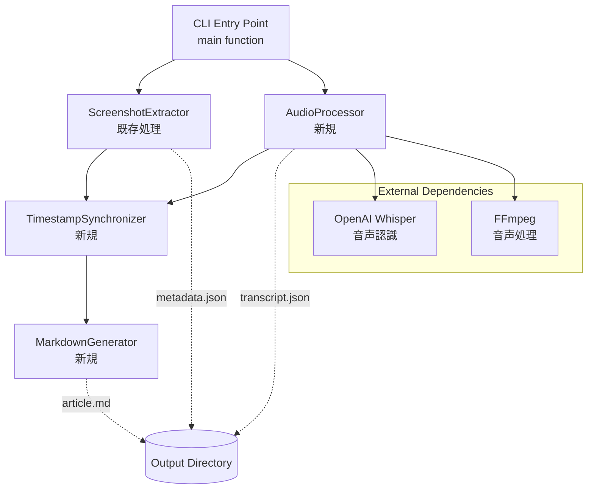
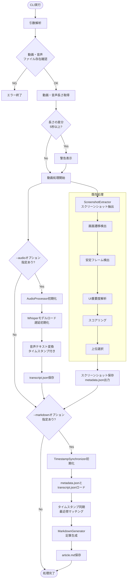
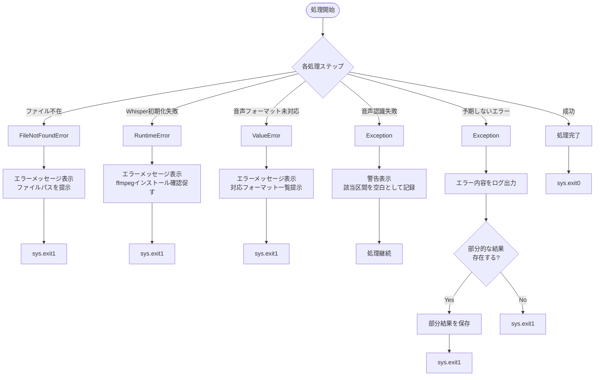
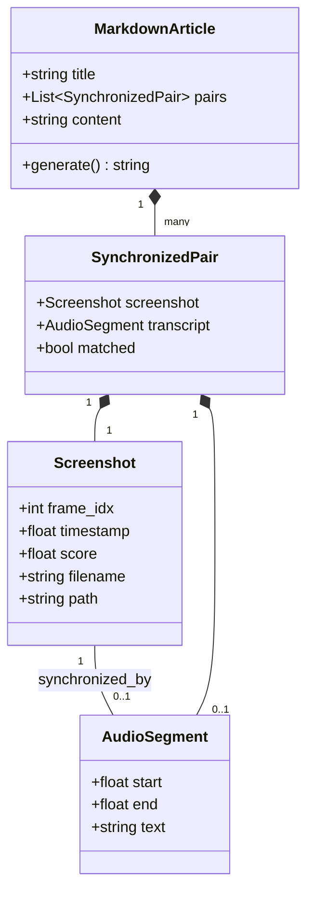
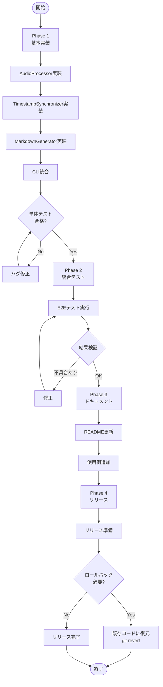

# 技術設計書: 音声・動画統合Markdown記事生成機能

## Overview

本機能は、画面録画動画と別録音声ファイルを統合し、スクリーンショットと音声解説を組み合わせたMarkdown記事を自動生成する機能を既存のScreenshot Extractorに追加する。

**Purpose**: アプリ紹介記事の作成を効率化するため、動画の視覚情報と音声の解説内容を自動的に統合し、読者がすぐに試してみたくなるような体裁の整ったMarkdownドキュメントを生成する。

**Users**: アプリのドキュメント作成者、技術ライター、マーケティング担当者が、デモ動画と音声解説からブログ記事やドキュメントを作成する際に利用する。

**Impact**: 既存のスクリーンショット抽出機能に音声認識とMarkdown生成機能を統合することで、手動でのスクリーンショット配置とテキスト入力作業を大幅に削減する。

### Goals

- 動画ファイルと音声ファイルの同時入力と時間軸の自動対応付け
- 日本語音声の高精度テキスト変換（Whisperモデルを使用）
- スクリーンショットと音声テキストの時間ベースの同期
- 標準Markdown形式の記事自動生成（画像埋め込み、説明文配置）
- 既存のCLIインターフェースとの統合（後方互換性の維持）

### Non-Goals

- リアルタイム動画処理（引き続きバッチ処理のみ）
- 動画ファイルからの音声抽出（動画と音声は別ファイルとして入力）
- Markdown以外のフォーマット出力（HTML、PDF等）
- 音声テキストの自動編集・要約機能
- マルチ言語対応の拡張（日本語・英語のみサポート継続）

## Architecture

### Existing Architecture Analysis

既存システムは単一ファイル構成（`extract_screenshots.py`）で、以下の5ステージからなるパイプライン処理を実装している：

1. Scene Transition Detection（Perceptual Hashing）
2. Stable Frame Detection（フレーム差分解析）
3. UI Importance Analysis（EasyOCR）
4. Composite Scoring（統合スコアリング）
5. Top Selection with Deduplication（時間的重複排除）

**保持すべきアーキテクチャパターン**:
- クラスベースのパイプライン設計（ScreenshotExtractorクラス）
- ステージごとのメソッド分離
- 遅延初期化パターン（OCRリーダー）
- argparseによるCLI設計
- 出力ディレクトリ構造（`output/screenshots/`, `metadata.json`）

**統合アプローチ**:
- 既存のScreenshotExtractorクラスを拡張せず、新規AudioProcessorクラスとMarkdownGeneratorクラスを追加
- 既存の処理フローに影響を与えず、オプション機能として追加
- main関数内で条件分岐により新機能を呼び出す

### High-Level Architecture



**Architecture Integration**:
- 既存パターン保持: 単一ファイル構成、クラスベース設計、ステージ分離
- 新規コンポーネント追加理由: 音声処理とMarkdown生成は独立した責務であり、既存のScreenshotExtractorクラスに組み込むと単一責任原則に違反
- 技術スタック適合: Python標準、型ヒント継続、既存のOpenCVパイプラインと並列動作
- Steering準拠: 単一ファイルの原則維持、モジュールレベル関数でグルー処理を記述

### Technology Stack and Design Decisions

#### 音声認識技術

**選択**: OpenAI Whisper（openai-whisper）

**理由**:
- 日本語音声認識で高精度（多言語学習済み）
- セグメント単位のタイムスタンプが標準機能
- ローカル実行可能（APIコール不要、プライバシー保護）
- Python 3.11対応、Apple Silicon CPU最適化
- 既存のEasyOCR遅延初期化パターンと同様の設計が可能

**検討した代替案**:
- Google Speech-to-Text API: クラウド依存、コスト発生、レイテンシ
- Azure Speech Services: 同様にクラウド依存
- SpeechRecognition + pocketsphinx: 日本語精度が低い

**選定アプローチ**:
- `whisper.load_model("base")`でモデルサイズと精度のバランスを確保
- `transcribe(audio, language="ja")`で日本語指定、タイムスタンプ有効化
- 遅延初期化で初回のみモデルダウンロード（EasyOCRパターンを踏襲）

**トレードオフ**:
- 利点: 高精度、ローカル実行、タイムスタンプ標準対応
- 欠点: 初回実行時にモデルダウンロード（約150MB）、処理速度は音声長に依存

#### 音声ファイル処理

**選択**: FFmpeg（既存依存）

**理由**:
- 動画処理で既にOpenCVが依存しているため、追加インストール不要
- 様々な音声フォーマット対応（mp3, wav, m4a, aac等）
- Whisperがffmpegを内部で利用するため親和性が高い

#### Markdown生成

**選択**: 標準ライブラリによる文字列操作（外部ライブラリなし）

**理由**:
- 生成するMarkdown構造が単純（見出し、画像リンク、テキスト）
- Python標準のf-stringとPathlib.write_textで十分
- 依存関係を増やさず、軽量性を維持

**検討した代替案**:
- SnakeMD: 複雑なMarkdown生成には有用だが、本ケースでは過剰
- python-markdown-generator: 同様に機能過多

**選定アプローチ**:
```python
def generate_markdown(screenshots: List[Dict], transcripts: List[Dict]) -> str:
    lines = ["# アプリ紹介\n\n"]
    for shot in screenshots:
        lines.append(f"## {shot['timestamp']}\n\n")
        lines.append(f"\n\n")
        lines.append(f"{shot['description']}\n\n")
    return "".join(lines)
```

**トレードオフ**:
- 利点: 依存なし、シンプル、軽量、カスタマイズ容易
- 欠点: 複雑なMarkdown構造が必要になった場合の拡張性

### Key Design Decisions

#### 決定1: タイムスタンプ同期戦略

**Decision**: 最近傍マッチング（Nearest Neighbor Matching）を採用

**Context**:
- スクリーンショットは不定期なタイムスタンプ（遷移検出ベース）
- 音声テキストはWhisperのセグメント（通常2-10秒）
- 各スクリーンショットに対応する音声テキストを自動割り当て

**Alternatives**:
1. 固定時間窓マッチング: スクリーンショット前後N秒の音声を全て取得
2. セグメント境界マッチング: スクリーンショットを含むセグメントを選択
3. 最近傍マッチング: スクリーンショットのタイムスタンプに最も近いセグメントを選択

**Selected Approach**: 最近傍マッチング

実装:
```python
def find_nearest_transcript(screenshot_time: float,
                           transcripts: List[Dict]) -> Optional[Dict]:
    """
    スクリーンショットのタイムスタンプに最も近い音声セグメントを検索

    Args:
        screenshot_time: スクリーンショットのタイムスタンプ（秒）
        transcripts: Whisperの出力セグメントリスト

    Returns:
        最も近いセグメント、または該当なしの場合はNone
    """
    if not transcripts:
        return None

    # セグメントの中央時間でソート済みと仮定
    min_distance = float('inf')
    nearest = None

    for segment in transcripts:
        segment_center = (segment['start'] + segment['end']) / 2
        distance = abs(screenshot_time - segment_center)

        # 5秒以内の最近傍を優先
        if distance < min_distance and distance <= 5.0:
            min_distance = distance
            nearest = segment

    return nearest
```

**Rationale**:
- スクリーンショットと音声の時間的対応が直感的
- 実装がシンプル（O(n*m)だが、n, mは小さい）
- 5秒の閾値により無関係なテキストの割り当てを防止

**Trade-offs**:
- 利点: シンプル、直感的、エッジケースが少ない
- 欠点: 音声セグメントが長い場合や無音区間が多い場合に精度低下の可能性

#### 決定2: 音声ファイル時間長検証戦略

**Decision**: 警告表示のみで処理継続（ソフトバリデーション）

**Context**:
- 動画と音声ファイルは別録で長さが完全一致しない可能性
- ユーザーは手動で録音開始/停止タイミングを調整している可能性

**Alternatives**:
1. 厳格な検証: 1秒以上のずれで処理中断
2. ソフトバリデーション: 5秒以上のずれで警告表示、処理継続
3. 自動補正: タイムスタンプオフセットを自動計算

**Selected Approach**: ソフトバリデーション（5秒閾値）

実装:
```python
def validate_duration_match(video_duration: float,
                           audio_duration: float) -> bool:
    """
    動画と音声の長さを検証

    Returns:
        True: 処理継続可能
        False: 処理継続不可（エラー）
    """
    diff = abs(video_duration - audio_duration)

    if diff > 5.0:
        print(f"Warning: Duration mismatch - Video: {video_duration:.1f}s, "
              f"Audio: {audio_duration:.1f}s (diff: {diff:.1f}s)")
        print("Proceeding with synchronization, but results may be inaccurate.")

    return True  # 常に処理継続
```

**Rationale**:
- ユーザーの録音方法の柔軟性を尊重
- 小さなずれは同期アルゴリズムで吸収可能
- 大きなずれは警告で通知し、ユーザー判断に委ねる

**Trade-offs**:
- 利点: ユーザービリティ向上、録音失敗による再撮影を回避
- 欠点: 著しく長さが異なる場合でも処理が進むため、誤った結果が生成される可能性

#### 決定3: Markdown出力構造

**Decision**: タイムスタンプ区切りの階層構造

**Context**:
- 記事の読みやすさと構造化のバランス
- 画像とテキストの視覚的な対応関係の明確化

**Alternatives**:
1. フラット構造: 全て同一レベルの見出し
2. 時間軸区切り: タイムスタンプごとにセクション分割（H2見出し）
3. ステップ番号区切り: 手順番号でセクション化

**Selected Approach**: 時間軸区切り（H2見出し）

出力フォーマット:
```markdown
# {動画タイトル}

## 00:15 - 起動画面


アプリを起動すると、ログイン画面が表示されます。

## 00:32 - ログイン処理


ユーザー名とパスワードを入力してログインボタンをタップします。
```

**Rationale**:
- タイムスタンプによる構造化で動画との対応が明確
- Markdownエディタでの目次生成が容易（H2ベース）
- 読者が特定の操作手順を素早く見つけられる

**Trade-offs**:
- 利点: 構造化、ナビゲーション性、動画参照が容易
- 欠点: 音声テキストから適切な見出しを生成するロジックが必要

## System Flows

### 音声・動画統合処理フロー



### エラーハンドリングフロー



## Requirements Traceability

| Requirement | 要約 | Components | Interfaces | Flows |
|-------------|------|------------|------------|-------|
| 1.1 | 動画・音声ファイル存在検証 | AudioProcessor | `validate_files()` | 音声・動画統合処理フロー |
| 1.2 | ファイル不在時のエラー処理 | AudioProcessor | `validate_files()` | エラーハンドリングフロー |
| 1.3 | 音声ファイル読み込みと時間軸対応 | AudioProcessor | `load_audio()`, `get_duration()` | 音声・動画統合処理フロー |
| 1.4 | 動画・音声長さ差異の警告 | AudioProcessor | `validate_duration_match()` | 音声・動画統合処理フロー |
| 2.1 | 音声認識APIによるテキスト変換 | AudioProcessor | `transcribe_audio()` | 音声・動画統合処理フロー |
| 2.2 | 日本語音声の正確な認識 | AudioProcessor（Whisper） | `transcribe_audio(language="ja")` | 音声・動画統合処理フロー |
| 2.3 | テキストとタイムスタンプの保持 | AudioProcessor | `transcribe_audio()` 戻り値 | 音声・動画統合処理フロー |
| 2.4 | 音声認識失敗区間の処理継続 | AudioProcessor | Exception handling | エラーハンドリングフロー |
| 3.1 | タイムスタンプに最も近い音声テキスト特定 | TimestampSynchronizer | `find_nearest_transcript()` | 音声・動画統合処理フロー |
| 3.2 | 前後数秒の範囲からテキスト区間選択 | TimestampSynchronizer | `find_nearest_transcript()` | 音声・動画統合処理フロー |
| 3.3 | 対応テキストなしの場合の空説明文 | TimestampSynchronizer | `synchronize()` | 音声・動画統合処理フロー |
| 3.4 | 連続スクリーンショットの音声テキスト分割 | TimestampSynchronizer | `synchronize()` | 音声・動画統合処理フロー |
| 4.1 | Markdownファイル生成 | MarkdownGenerator | `generate()` | 音声・動画統合処理フロー |
| 4.2 | 画像リンクの挿入 | MarkdownGenerator | `generate()` | 音声・動画統合処理フロー |
| 4.3 | 音声テキストの説明文配置 | MarkdownGenerator | `generate()` | 音声・動画統合処理フロー |
| 4.4 | 標準Markdown記法の使用 | MarkdownGenerator | `generate()` | 音声・動画統合処理フロー |
| 4.5 | 音声テキストなし画像のプレースホルダー | MarkdownGenerator | `generate()` | 音声・動画統合処理フロー |
| 5.1 | 指定ディレクトリへの保存 | MarkdownGenerator | `save()` | 音声・動画統合処理フロー |
| 5.2 | 出力ディレクトリ構造の作成 | MarkdownGenerator | `save()` | 音声・動画統合処理フロー |
| 5.3 | 相対パスでの画像パス記述 | MarkdownGenerator | `generate()` | 音声・動画統合処理フロー |
| 5.4 | 既存ファイルの上書き確認 | MarkdownGenerator | `save()` | 音声・動画統合処理フロー |
| 5.5 | 出力完了時の統計情報表示 | main関数 | CLI出力 | 音声・動画統合処理フロー |
| 6.1 | --audioオプションの追加 | argparse設定 | CLI | 音声・動画統合処理フロー |
| 6.2 | --markdownオプションの追加 | argparse設定 | CLI | 音声・動画統合処理フロー |
| 6.3 | 音声なしMarkdown生成 | main関数 | 条件分岐 | 音声・動画統合処理フロー |
| 6.4 | CLIヘルプの更新 | argparse設定 | CLI | - |
| 6.5 | 既存処理との統合実行 | main関数 | オーケストレーション | 音声・動画統合処理フロー |
| 7.1 | 音声処理の進捗表示 | AudioProcessor | tqdm進捗バー | 音声・動画統合処理フロー |
| 7.2 | 音声認識APIエラー表示 | AudioProcessor | Exception handling | エラーハンドリングフロー |
| 7.3 | 未対応フォーマットのエラー表示 | AudioProcessor | Exception handling | エラーハンドリングフロー |
| 7.4 | Markdown生成完了の表示 | main関数 | CLI出力 | 音声・動画統合処理フロー |
| 7.5 | 予期しないエラーの記録と部分結果保存 | main関数 | Exception handling | エラーハンドリングフロー |

## Components and Interfaces

### Audio Processing Domain

#### AudioProcessor

**Responsibility & Boundaries**
- **Primary Responsibility**: 音声ファイルの読み込み、検証、テキスト変換を実行
- **Domain Boundary**: 音声処理ドメイン（動画処理やMarkdown生成には関与しない）
- **Data Ownership**: 音声ファイルパス、音声認識結果（transcript.json）
- **Transaction Boundary**: 音声ファイル単位（1ファイル = 1トランザクション）

**Dependencies**
- **Inbound**: main関数から呼び出される
- **Outbound**: OpenAI Whisperライブラリ、FFmpeg（システムコマンド）
- **External**:
  - `openai-whisper`: 音声認識エンジン
  - `ffmpeg`: 音声ファイル処理（Whisperが内部で利用）

**External Dependencies Investigation**:

OpenAI Whisper:
- バージョン: 最新安定版（執筆時点で20231117以降）
- インストール: `pip install openai-whisper`
- システム要件: Python 3.8-3.11, PyTorch, ffmpeg
- API:
  ```python
  import whisper
  model = whisper.load_model("base")  # tiny, base, small, medium, large, turbo
  result = model.transcribe("audio.mp3", language="ja")
  # result = {
  #   "text": "全文テキスト",
  #   "segments": [
  #     {"start": 0.0, "end": 3.5, "text": "セグメント1"},
  #     {"start": 3.5, "end": 7.2, "text": "セグメント2"}
  #   ]
  # }
  ```
- 日本語対応: 全モデルで日本語サポート、`language="ja"`指定推奨
- パフォーマンス: baseモデルで約7倍速（実時間比）、Apple Silicon CPU最適化
- メモリ: baseモデルで約1GB VRAM（CPUモードでは2GB RAM程度）
- エラーパターン:
  - `RuntimeError`: ffmpegが見つからない場合
  - `FileNotFoundError`: 音声ファイルが存在しない場合
  - サポートされる形式: mp3, mp4, mpeg, mpga, m4a, wav, webm

FFmpeg:
- インストール確認: `ffmpeg -version`
- macOS: `brew install ffmpeg`
- Whisperが内部で利用するため、明示的な呼び出しは不要
- 音声長取得には`subprocess`でffprobeを使用

**リスク**:
- 初回実行時のモデルダウンロード（約150MB、ユーザー環境により時間がかかる）
- 長時間音声の処理時間（1時間の音声で約8分の処理時間、baseモデル）
- メモリ使用量の増加（OCRとWhisperの両方が必要な場合）

**Contract Definition**

**Service Interface**:
```python
from typing import List, Dict, Optional
from pathlib import Path

class AudioProcessor:
    """音声ファイル処理クラス"""

    def __init__(self, audio_path: str, output_dir: str, model_size: str = "base"):
        """
        Args:
            audio_path: 音声ファイルパス
            output_dir: 出力ディレクトリ
            model_size: Whisperモデルサイズ（tiny, base, small, medium, large, turbo）

        Raises:
            FileNotFoundError: 音声ファイルが存在しない場合
        """
        pass

    def validate_files(self) -> bool:
        """
        音声ファイルの存在とフォーマットを検証

        Returns:
            True: 検証成功
            False: 検証失敗

        Raises:
            FileNotFoundError: ファイルが存在しない
            ValueError: サポートされていないフォーマット
        """
        pass

    def get_duration(self) -> float:
        """
        音声ファイルの長さを取得

        Returns:
            音声ファイルの長さ（秒）

        Raises:
            RuntimeError: ffprobeが利用できない
        """
        pass

    def validate_duration_match(self, video_duration: float) -> bool:
        """
        動画と音声の長さを検証

        Args:
            video_duration: 動画の長さ（秒）

        Returns:
            True: 処理継続可能（差異が5秒以下、または警告表示済み）
            False: 処理継続不可（エラー）

        Preconditions:
            - audio_pathが存在し、有効な音声ファイルである
            - video_durationが正の値である

        Postconditions:
            - 差異が5秒以上の場合、警告メッセージが標準出力に表示される
        """
        pass

    def transcribe_audio(self, language: str = "ja") -> List[Dict]:
        """
        音声ファイルをテキストに変換

        Args:
            language: 言語コード（ja, en等）

        Returns:
            セグメントリスト: [
                {
                    "start": 0.0,
                    "end": 3.5,
                    "text": "テキスト内容"
                },
                ...
            ]

        Raises:
            RuntimeError: Whisperモデルのロードに失敗
            Exception: 音声認識処理中のエラー（警告表示して空リスト返却）

        Preconditions:
            - Whisperモデルがロード済み（遅延初期化）
            - 音声ファイルが読み込み可能

        Postconditions:
            - transcript.jsonに結果が保存される
            - セグメントはタイムスタンプ順にソート済み
        """
        pass

    def save_transcript(self, segments: List[Dict]) -> Path:
        """
        音声認識結果をJSONファイルに保存

        Args:
            segments: transcribe_audio()の戻り値

        Returns:
            保存したファイルのパス（output_dir/transcript.json）
        """
        pass
```

**State Management**:
- **State Model**:
  - 初期状態: 未初期化（Whisperモデル未ロード）
  - 初期化完了: Whisperモデルロード済み
  - 処理中: 音声認識実行中
  - 完了: transcript.json保存済み
- **Persistence**: transcript.jsonファイルに結果を永続化
- **Concurrency**: 単一スレッド処理のみ（並列処理は非対応）

**Integration Strategy**:
- **Modification Approach**: 既存コードに影響を与えず、新規クラスとして追加
- **Backward Compatibility**: --audioオプションなしの場合は既存動作を完全に維持
- **Migration Path**: 段階的な機能追加（v1: 音声認識のみ、v2: Markdown生成統合）

### Synchronization Domain

#### TimestampSynchronizer

**Responsibility & Boundaries**
- **Primary Responsibility**: スクリーンショットのタイムスタンプと音声セグメントを対応付ける
- **Domain Boundary**: 時間軸同期ドメイン（音声認識やMarkdown生成には関与しない）
- **Data Ownership**: 同期マッピング情報（スクリーンショット ↔ 音声テキスト）
- **Transaction Boundary**: 同期処理全体（全スクリーンショットを一括処理）

**Dependencies**
- **Inbound**: main関数から呼び出される
- **Outbound**: なし（純粋な計算処理）
- **External**: なし

**Contract Definition**

**Service Interface**:
```python
from typing import List, Dict, Optional

class TimestampSynchronizer:
    """タイムスタンプ同期クラス"""

    def __init__(self, tolerance: float = 5.0):
        """
        Args:
            tolerance: 同期許容範囲（秒）、この範囲内の最近傍を選択
        """
        pass

    def synchronize(self,
                    screenshots: List[Dict],
                    transcripts: List[Dict]) -> List[Dict]:
        """
        スクリーンショットと音声セグメントを同期

        Args:
            screenshots: metadata.jsonのスクリーンショット情報
            transcripts: transcript.jsonの音声セグメント情報

        Returns:
            同期結果リスト: [
                {
                    "screenshot": {...},  # 元のスクリーンショット情報
                    "transcript": {...} | None,  # 対応する音声セグメント
                    "matched": bool  # マッチング成功フラグ
                },
                ...
            ]

        Preconditions:
            - screenshotsとtranscriptsは共にタイムスタンプでソート済み
            - timestampキーが存在する

        Postconditions:
            - 全てのスクリーンショットが結果に含まれる
            - 対応する音声がない場合、transcriptはNone
            - 結果はスクリーンショットの順序を維持

        Invariants:
            - 戻り値の長さ == len(screenshots)
        """
        pass

    def find_nearest_transcript(self,
                                screenshot_time: float,
                                transcripts: List[Dict]) -> Optional[Dict]:
        """
        スクリーンショットのタイムスタンプに最も近い音声セグメントを検索

        Args:
            screenshot_time: スクリーンショットのタイムスタンプ（秒）
            transcripts: 音声セグメントリスト

        Returns:
            最も近いセグメント、またはNone

        Preconditions:
            - screenshot_timeは0以上
            - transcriptsの各要素にstart, endキーが存在

        Postconditions:
            - 戻り値がNoneでない場合、toleranceの範囲内
            - 複数候補がある場合、最も近いものを返す
        """
        pass

    def calculate_distance(self, time1: float, time2: float) -> float:
        """
        2つのタイムスタンプ間の距離を計算

        Args:
            time1: タイムスタンプ1（秒）
            time2: タイムスタンプ2（秒）

        Returns:
            絶対距離（秒）
        """
        pass
```

**State Management**:
- **State Model**: ステートレス（状態を保持しない純粋関数）
- **Persistence**: なし（結果はMarkdownGeneratorに渡される）
- **Concurrency**: スレッドセーフ（状態を持たないため）

### Output Generation Domain

#### MarkdownGenerator

**Responsibility & Boundaries**
- **Primary Responsibility**: 同期済みデータからMarkdownファイルを生成
- **Domain Boundary**: 出力生成ドメイン（音声認識や同期処理には関与しない）
- **Data Ownership**: 生成されたMarkdownファイル（article.md）
- **Transaction Boundary**: ファイル生成単位（1ファイル = 1トランザクション）

**Dependencies**
- **Inbound**: main関数から呼び出される
- **Outbound**: ファイルシステム（Pathlib）
- **External**: なし

**Contract Definition**

**Service Interface**:
```python
from typing import List, Dict, Optional
from pathlib import Path

class MarkdownGenerator:
    """Markdown記事生成クラス"""

    def __init__(self, output_dir: str, title: str = "アプリ紹介"):
        """
        Args:
            output_dir: 出力ディレクトリ
            title: 記事タイトル（H1見出し）
        """
        pass

    def generate(self, synchronized_data: List[Dict]) -> str:
        """
        同期済みデータからMarkdown文字列を生成

        Args:
            synchronized_data: TimestampSynchronizer.synchronize()の戻り値

        Returns:
            Markdown形式の文字列

        Preconditions:
            - synchronized_dataが有効なリスト
            - 各要素にscreenshotキーが存在

        Postconditions:
            - 標準Markdown形式（画像: , 見出し: ##）
            - 画像パスは相対パス
            - 音声テキストがない場合はプレースホルダー
        """
        pass

    def format_section_title(self, screenshot: Dict, transcript: Optional[Dict]) -> str:
        """
        セクション見出しを生成

        Args:
            screenshot: スクリーンショット情報
            transcript: 音声セグメント情報（None可）

        Returns:
            H2見出し文字列（例: "## 00:15 - 起動画面"）

        Preconditions:
            - screenshot['timestamp']が存在

        Postconditions:
            - タイムスタンプはMM:SS形式
            - 音声テキストから適切な短いタイトルを抽出（最大20文字）
        """
        pass

    def format_timestamp(self, seconds: float) -> str:
        """
        秒数をMM:SS形式に変換

        Args:
            seconds: タイムスタンプ（秒）

        Returns:
            MM:SS形式の文字列
        """
        pass

    def get_relative_image_path(self, screenshot: Dict) -> str:
        """
        画像の相対パスを取得

        Args:
            screenshot: スクリーンショット情報

        Returns:
            相対パス（例: "screenshots/01_00-15_score87.png"）
        """
        pass

    def format_description(self, transcript: Optional[Dict]) -> str:
        """
        説明文を整形

        Args:
            transcript: 音声セグメント情報（None可）

        Returns:
            説明文テキスト、またはプレースホルダー

        Postconditions:
            - transcriptがNoneの場合: "(説明文なし)"
            - transcriptがある場合: テキストをそのまま返す
        """
        pass

    def save(self, markdown_content: str, filename: str = "article.md") -> Path:
        """
        Markdownファイルを保存

        Args:
            markdown_content: generate()の戻り値
            filename: ファイル名

        Returns:
            保存したファイルのパス

        Preconditions:
            - output_dirが存在する（存在しない場合は作成）

        Postconditions:
            - ファイルがUTF-8エンコーディングで保存される
            - 既存ファイルがある場合は上書き（警告表示）
        """
        pass

    def display_statistics(self, synchronized_data: List[Dict]) -> None:
        """
        生成統計情報を表示

        Args:
            synchronized_data: TimestampSynchronizer.synchronize()の戻り値

        Postconditions:
            - 標準出力に統計情報が表示される
            - 画像数、マッチング成功数、マッチング失敗数
        """
        pass
```

**State Management**:
- **State Model**: ステートレス（インスタンス変数は設定のみ）
- **Persistence**: article.mdファイルに結果を永続化
- **Concurrency**: スレッドセーフ（状態を持たないため）

**Integration Strategy**:
- **Modification Approach**: 既存コードに影響を与えず、新規クラスとして追加
- **Backward Compatibility**: --markdownオプションなしの場合は既存動作を完全に維持
- **Migration Path**: オプション機能として段階的導入

### Orchestration

#### main関数の拡張

既存のmain関数を拡張し、新機能を統合する。

**変更点**:
```python
def main():
    parser = argparse.ArgumentParser(...)

    # 既存のオプション
    parser.add_argument('-i', '--input', required=True, ...)
    parser.add_argument('-o', '--output', default='./output', ...)
    parser.add_argument('-c', '--count', type=int, default=10, ...)
    parser.add_argument('-t', '--threshold', type=int, default=25, ...)
    parser.add_argument('--interval', type=float, default=15.0, ...)

    # 新規オプション
    parser.add_argument('--audio', type=str, default=None,
                       help='音声ファイルパス（任意）')
    parser.add_argument('--markdown', action='store_true',
                       help='Markdown記事を生成する（任意）')
    parser.add_argument('--model-size', type=str, default='base',
                       choices=['tiny', 'base', 'small', 'medium', 'large', 'turbo'],
                       help='Whisperモデルサイズ（デフォルト: base）')

    args = parser.parse_args()

    # 既存処理
    extractor = ScreenshotExtractor(...)
    metadata = extractor.extract_screenshots()

    # 新機能: 音声処理
    transcript_data = None
    if args.audio:
        audio_processor = AudioProcessor(
            audio_path=args.audio,
            output_dir=args.output,
            model_size=args.model_size
        )
        if not audio_processor.validate_files():
            sys.exit(1)

        video_duration = extractor.video_duration
        audio_duration = audio_processor.get_duration()
        if not audio_processor.validate_duration_match(video_duration):
            sys.exit(1)

        transcript_data = audio_processor.transcribe_audio(language="ja")
        audio_processor.save_transcript(transcript_data)

    # 新機能: Markdown生成
    if args.markdown:
        if args.audio and transcript_data:
            # 音声あり: 同期してMarkdown生成
            synchronizer = TimestampSynchronizer(tolerance=5.0)
            synchronized = synchronizer.synchronize(metadata, transcript_data)
        else:
            # 音声なし: スクリーンショットのみでMarkdown生成
            synchronized = [{"screenshot": m, "transcript": None, "matched": False}
                           for m in metadata]

        md_generator = MarkdownGenerator(
            output_dir=args.output,
            title="アプリ紹介"
        )
        markdown_content = md_generator.generate(synchronized)
        output_path = md_generator.save(markdown_content)
        md_generator.display_statistics(synchronized)

        print(f"\nMarkdown article saved to {output_path}")

    sys.exit(0)
```

**Backward Compatibility保証**:
- 既存のオプション（-i, -o, -c, -t, --interval）の動作は完全に維持
- --audioおよび--markdownオプションなしの場合、既存の動作と完全に同一
- 既存のmetadata.jsonフォーマットは変更なし

## Data Models

### Domain Model

本機能の中心的なデータ概念:

**Core Concepts**:

1. **Screenshot (Entity)**: スクリーンショットの抽出結果
   - 識別子: frame_idx（フレーム番号）
   - タイムスタンプ、スコア、画像パス
   - 既存のScreenshotExtractorが生成

2. **AudioSegment (Entity)**: 音声認識の結果セグメント
   - 識別子: start時刻
   - 開始・終了時刻、テキスト内容
   - AudioProcessorが生成

3. **SynchronizedPair (Value Object)**: スクリーンショットと音声セグメントの対応関係
   - 不変（Immutable）
   - screenshot（Screenshot）とtranscript（AudioSegment）のペア
   - TimestampSynchronizerが生成

4. **MarkdownArticle (Aggregate)**: 生成されるMarkdown記事
   - Aggregate Root
   - 複数のSynchronizedPairから構成
   - MarkdownGeneratorが生成

**Business Rules & Invariants**:
- タイムスタンプは必ず0以上の値である
- スクリーンショットは時系列順にソートされている
- 音声セグメントは重複しない（Whisperが保証）
- 各スクリーンショットは最大1つの音声セグメントと対応（1:0または1:1）
- Markdown記事内の画像パスは相対パスである

**Conceptual Diagram**:



### Physical Data Model

#### metadata.json（既存）

スクリーンショット情報のJSONファイル（既存のフォーマットを維持）:

```json
[
  {
    "index": 1,
    "filename": "01_00-15_score87.png",
    "timestamp": 15.5,
    "score": 87.0,
    "transition_magnitude": 42,
    "stability_score": 95.3,
    "ui_importance_score": 65.0,
    "ui_elements": [
      {"type": "button", "text": "ログイン", "confidence": 0.95}
    ],
    "detected_texts": ["ログイン", "新規登録"]
  }
]
```

**型定義**:
```python
from typing import TypedDict, List

class UIElement(TypedDict):
    type: str  # "button" | "title"
    text: str
    confidence: float

class ScreenshotMetadata(TypedDict):
    index: int
    filename: str
    timestamp: float
    score: float
    transition_magnitude: int
    stability_score: float
    ui_importance_score: float
    ui_elements: List[UIElement]
    detected_texts: List[str]
```

#### transcript.json（新規）

音声認識結果のJSONファイル:

```json
{
  "language": "ja",
  "duration": 125.3,
  "segments": [
    {
      "start": 0.0,
      "end": 3.5,
      "text": "アプリを起動すると、ログイン画面が表示されます。"
    },
    {
      "start": 3.5,
      "end": 7.8,
      "text": "ユーザー名とパスワードを入力してログインボタンをタップします。"
    }
  ]
}
```

**型定義**:
```python
from typing import TypedDict, List

class AudioSegment(TypedDict):
    start: float  # 開始時刻（秒）
    end: float    # 終了時刻（秒）
    text: str     # テキスト内容

class TranscriptData(TypedDict):
    language: str  # 言語コード（ja, en）
    duration: float  # 音声ファイル全体の長さ（秒）
    segments: List[AudioSegment]
```

#### article.md（新規）

生成されるMarkdownファイル:

```markdown
# アプリ紹介

## 00:15 - ログイン画面


アプリを起動すると、ログイン画面が表示されます。

## 00:32 - ログイン処理


ユーザー名とパスワードを入力してログインボタンをタップします。

## 00:48 - (説明文なし)


(説明文なし)
```

**フォーマット仕様**:
- H1見出し: 記事タイトル（デフォルト: "アプリ紹介"）
- H2見出し: タイムスタンプ（MM:SS形式） + 音声テキストから抽出した短いタイトル
- 画像: ``
- 説明文: 音声テキスト、または "(説明文なし)"
- 各セクションは空行で区切る

### Data Contracts & Integration

#### metadata.json → TimestampSynchronizer

**Schema**:
```typescript
// 入力: metadata.json
interface ScreenshotMetadata {
  timestamp: number;  // 必須
  filename: string;   // 必須
  [key: string]: any; // その他のフィールドは透過的に扱う
}
```

**Validation Rules**:
- `timestamp`は必須、0以上の数値
- `filename`は必須、非空文字列
- リストは少なくとも1要素を含む

#### transcript.json → TimestampSynchronizer

**Schema**:
```typescript
// 入力: transcript.json
interface TranscriptData {
  segments: AudioSegment[];  // 必須
}

interface AudioSegment {
  start: number;  // 必須、0以上
  end: number;    // 必須、start以上
  text: string;   // 必須
}
```

**Validation Rules**:
- `segments`は必須、配列
- `start` < `end`
- `text`は非空文字列

#### SynchronizedData → MarkdownGenerator

**Schema**:
```typescript
// 中間データ: TimestampSynchronizer.synchronize()の出力
interface SynchronizedPair {
  screenshot: ScreenshotMetadata;  // 必須
  transcript: AudioSegment | null; // オプション
  matched: boolean;                // 必須
}
```

**Contract**:
- `screenshot`は常に存在
- `matched`が`true`の場合、`transcript`は非null
- `matched`が`false`の場合、`transcript`はnull

## Error Handling

### Error Strategy

**エラーカテゴリ別の処理方針**:

1. **ユーザーエラー（User Errors）**: 入力ミスや設定誤り
   - 明確なエラーメッセージと修正方法を表示
   - 即座に処理を中断（sys.exit(1)）

2. **システムエラー（System Errors）**: 外部依存の障害
   - エラー詳細とトラブルシューティング情報を表示
   - 可能であれば代替処理、不可能なら中断

3. **ビジネスロジックエラー（Business Logic Errors）**: データ制約違反
   - 警告表示して処理継続、または部分的な結果を保存

### Error Categories and Responses

#### User Errors (入力エラー)

**ファイル不在エラー**:
```python
# エラー例
FileNotFoundError: Video file not found: /path/to/video.mp4

# 処理
def validate_files(self) -> bool:
    if not Path(self.audio_path).exists():
        print(f"Error: Audio file not found: {self.audio_path}")
        print("Please check the file path and try again.")
        return False
    return True
```

**未対応フォーマットエラー**:
```python
# エラー例
ValueError: Unsupported audio format: .ogg

# 処理
SUPPORTED_FORMATS = ['.mp3', '.mp4', '.mpeg', '.mpga', '.m4a', '.wav', '.webm']

def validate_files(self) -> bool:
    ext = Path(self.audio_path).suffix.lower()
    if ext not in SUPPORTED_FORMATS:
        print(f"Error: Unsupported audio format: {ext}")
        print(f"Supported formats: {', '.join(SUPPORTED_FORMATS)}")
        return False
    return True
```

#### System Errors (外部依存エラー)

**Whisperモデルロード失敗**:
```python
# エラー例
RuntimeError: ffmpeg not found. Please install ffmpeg.

# 処理
def transcribe_audio(self, language: str = "ja") -> List[Dict]:
    try:
        model = get_whisper_model(self.model_size)
        result = model.transcribe(self.audio_path, language=language)
        return result['segments']
    except RuntimeError as e:
        if "ffmpeg" in str(e).lower():
            print("Error: ffmpeg is not installed or not found in PATH.")
            print("Please install ffmpeg:")
            print("  macOS: brew install ffmpeg")
            print("  Ubuntu/Debian: sudo apt install ffmpeg")
            raise
        else:
            print(f"Error: Failed to load Whisper model: {e}")
            raise
```

**音声認識処理失敗（部分的な失敗）**:
```python
# エラー例
Exception: Failed to transcribe segment at 45.2s

# 処理
def transcribe_audio(self, language: str = "ja") -> List[Dict]:
    try:
        model = get_whisper_model(self.model_size)
        result = model.transcribe(self.audio_path, language=language)
        return result['segments']
    except Exception as e:
        print(f"Warning: Audio transcription failed: {e}")
        print("Continuing without audio transcription.")
        return []  # 空リストを返して処理継続
```

#### Business Logic Errors (データ制約エラー)

**動画・音声長さ不一致**:
```python
# 警告例
Warning: Duration mismatch - Video: 125.5s, Audio: 132.3s (diff: 6.8s)

# 処理（Requirement 1.4）
def validate_duration_match(self, video_duration: float) -> bool:
    audio_duration = self.get_duration()
    diff = abs(video_duration - audio_duration)

    if diff > 5.0:
        print(f"Warning: Duration mismatch - Video: {video_duration:.1f}s, "
              f"Audio: {audio_duration:.1f}s (diff: {diff:.1f}s)")
        print("Proceeding with synchronization, but results may be inaccurate.")
        print("Consider re-recording with synchronized start/stop times.")

    return True  # 警告のみ、処理継続
```

**タイムスタンプ同期失敗**:
```python
# 警告例
Warning: No matching transcript found for screenshot at 95.3s

# 処理（Requirement 3.3）
def find_nearest_transcript(self, screenshot_time: float,
                           transcripts: List[Dict]) -> Optional[Dict]:
    nearest = None
    min_distance = float('inf')

    for segment in transcripts:
        segment_center = (segment['start'] + segment['end']) / 2
        distance = abs(screenshot_time - segment_center)

        if distance < min_distance and distance <= self.tolerance:
            min_distance = distance
            nearest = segment

    if nearest is None:
        print(f"Warning: No matching transcript found for screenshot at {screenshot_time:.1f}s")

    return nearest  # Noneを返してMarkdownGeneratorで "(説明文なし)" を出力
```

### Monitoring

#### ログ出力

**標準出力（進捗情報）**:
- 各処理ステップの開始・完了メッセージ
- tqdmによる進捗バー（音声認識処理）
- 統計情報（生成された画像数、マッチング成功数）

**標準エラー出力（エラー情報）**:
- エラーメッセージとスタックトレース
- 警告メッセージ

**実装例**:
```python
import sys
from tqdm import tqdm

def transcribe_audio(self, language: str = "ja") -> List[Dict]:
    print("Step: Transcribing audio...")
    print(f"  Model: {self.model_size}")
    print(f"  Language: {language}")

    try:
        with tqdm(desc="Processing audio", unit="segment") as pbar:
            model = get_whisper_model(self.model_size)
            result = model.transcribe(
                self.audio_path,
                language=language,
                verbose=False  # tqdm進捗バーを使用
            )
            pbar.update(1)

        print(f"  Transcribed {len(result['segments'])} segments\n")
        return result['segments']

    except Exception as e:
        print(f"Error: Audio transcription failed: {e}", file=sys.stderr)
        raise
```

#### ヘルスチェック

本機能はバッチ処理のため、リアルタイムヘルスチェックは不要。代わりに、以下の実行時チェックを実施:

1. **事前検証**: ファイル存在確認、フォーマット検証、ffmpeg可用性確認
2. **処理中監視**: 進捗表示、エラーハンドリング
3. **事後検証**: 出力ファイル生成確認、統計情報表示

## Testing Strategy

### Unit Tests

#### AudioProcessor

1. **validate_files()**:
   - 存在するファイルでTrue
   - 存在しないファイルでFalse
   - サポートされていないフォーマットでFalse

2. **get_duration()**:
   - 有効な音声ファイルで正しい長さを返す
   - ffprobeが利用できない場合にRuntimeError

3. **validate_duration_match()**:
   - 差異が5秒以下で警告なし
   - 差異が5秒以上で警告表示

4. **transcribe_audio()**:
   - モック使用、Whisperの戻り値をシミュレート
   - 正常系: セグメントリストを返す
   - 異常系: Exceptionで空リストを返す

#### TimestampSynchronizer

1. **find_nearest_transcript()**:
   - 最近傍セグメントを正しく選択
   - tolerance範囲外の場合にNone
   - セグメントが空の場合にNone

2. **synchronize()**:
   - 全スクリーンショットが結果に含まれる
   - マッチング成功/失敗フラグの正確性
   - 順序の維持

3. **calculate_distance()**:
   - 正しい絶対距離を返す

#### MarkdownGenerator

1. **format_timestamp()**:
   - 秒数をMM:SS形式に正しく変換
   - 境界値（0秒、60秒、3600秒）

2. **format_section_title()**:
   - タイムスタンプと音声テキストから見出しを生成
   - 音声テキストがない場合のフォールバック

3. **format_description()**:
   - 音声テキストがある場合はそのまま返す
   - Noneの場合は "(説明文なし)"

4. **generate()**:
   - 正しいMarkdown構造を生成
   - 画像パスが相対パス
   - 全てのスクリーンショットが含まれる

5. **save()**:
   - ファイルが正しく保存される
   - 既存ファイルの上書き警告

### Integration Tests

#### 音声処理とタイムスタンプ同期

1. **AudioProcessor + TimestampSynchronizer**:
   - 実際の音声ファイル（テスト用短時間音声）を使用
   - transcript.jsonの生成とロード
   - metadata.jsonとの同期処理
   - 正しいマッチング結果の検証

#### Markdown生成エンドツーエンド

2. **TimestampSynchronizer + MarkdownGenerator**:
   - 同期済みデータからMarkdown生成
   - article.mdの内容検証（正しいMarkdown構文）
   - 画像パスの存在確認

#### CLI統合

3. **main関数オーケストレーション**:
   - --audio と --markdown オプションの組み合わせテスト
   - 既存オプションとの互換性確認
   - エラーハンドリングの統合テスト

#### エラーケースの統合

4. **異常系フロー**:
   - 音声ファイル不在時のエラーメッセージ
   - 動画・音声長さ不一致時の警告表示
   - Whisperモデルロード失敗時のエラー処理

### E2E Tests（CLIテスト）

#### 正常系シナリオ

1. **基本フロー（音声あり）**:
   ```bash
   python extract_screenshots.py -i demo.mp4 --audio demo.mp3 --markdown
   ```
   - output/screenshots/ に画像が生成される
   - output/transcript.json が生成される
   - output/article.md が生成される
   - article.mdの内容が正しい

2. **基本フロー（音声なし）**:
   ```bash
   python extract_screenshots.py -i demo.mp4 --markdown
   ```
   - output/article.md が生成される
   - 全セクションに "(説明文なし)"

3. **音声のみ（Markdownなし）**:
   ```bash
   python extract_screenshots.py -i demo.mp4 --audio demo.mp3
   ```
   - output/transcript.json のみ生成される
   - article.md は生成されない

#### 異常系シナリオ

4. **ファイル不在エラー**:
   ```bash
   python extract_screenshots.py -i demo.mp4 --audio nonexistent.mp3 --markdown
   ```
   - エラーメッセージが表示される
   - 処理が中断される（exit 1）

5. **動画・音声長さ不一致**:
   ```bash
   python extract_screenshots.py -i short.mp4 --audio long.mp3 --markdown
   ```
   - 警告メッセージが表示される
   - 処理は継続される
   - article.md が生成される

### Performance Tests（パフォーマンステスト）

#### 処理時間測定

1. **音声認識処理時間**:
   - 1分の音声: baseモデルで約8秒以内
   - 5分の音声: baseモデルで約40秒以内

2. **エンドツーエンド処理時間**:
   - 5分の動画 + 5分の音声: 全体で2分以内（スクリーンショット抽出含む）

#### メモリ使用量測定

3. **メモリ使用量**:
   - baseモデル: 2GB以内（CPU mode）
   - EasyOCRとWhisperの同時ロード: 3GB以内

#### スケーラビリティテスト

4. **長時間音声処理**:
   - 30分の音声: 処理完了確認（約4分）
   - 1時間の音声: 処理完了確認（約8分）

## Security Considerations

### データ保護とプライバシー

**ローカル処理の重視**:
- 音声認識はWhisperローカルモデルで実行（外部APIへのデータ送信なし）
- 動画・音声ファイルはユーザーの環境内で処理
- 生成されたファイル（transcript.json, article.md）もローカルに保存

**ファイルパーミッション**:
- 出力ディレクトリのパーミッション: 0755（ユーザーのみ書き込み可）
- 生成ファイルのパーミッション: 0644（ユーザーのみ書き込み可）

**実装**:
```python
def save_transcript(self, segments: List[Dict]) -> Path:
    output_path = Path(self.output_dir) / "transcript.json"
    output_path.parent.mkdir(parents=True, exist_ok=True, mode=0o755)

    with open(output_path, 'w', encoding='utf-8') as f:
        json.dump({
            "language": "ja",
            "duration": self.get_duration(),
            "segments": segments
        }, f, ensure_ascii=False, indent=2)

    # パーミッション明示的に設定
    output_path.chmod(0o644)

    return output_path
```

### 入力検証

**ファイルパス検証**:
- パストラバーサル攻撃の防止（`Path.resolve()`使用）
- シンボリックリンクの検証

**実装**:
```python
def validate_files(self) -> bool:
    audio_path = Path(self.audio_path).resolve()

    # パストラバーサル防止
    try:
        audio_path.relative_to(Path.cwd())
    except ValueError:
        # 作業ディレクトリ外のファイルは警告のみ（許可）
        print(f"Warning: Audio file is outside working directory: {audio_path}")

    # 存在確認
    if not audio_path.exists():
        print(f"Error: Audio file not found: {audio_path}")
        return False

    # 通常ファイル確認（ディレクトリやデバイスファイルを除外）
    if not audio_path.is_file():
        print(f"Error: Path is not a regular file: {audio_path}")
        return False

    return True
```

### 依存関係のセキュリティ

**Whisperモデルの検証**:
- 公式リポジトリからのモデルダウンロード
- チェックサム検証（Whisperが内部で実施）

**依存ライブラリの管理**:
- requirements.txtで明示的なバージョン指定
- 定期的な脆弱性チェック（pipenv check, safety）

## Performance & Scalability

### Target Metrics

**処理時間目標**:
- 5分の動画 + 5分の音声: エンドツーエンドで2分以内
- 音声認識処理: 音声長の約1/7の時間（baseモデル）

**メモリ使用量目標**:
- 最大メモリ使用量: 3GB以内（EasyOCR + Whisper同時ロード）
- 通常動作時: 2GB以内

**スループット目標**:
- 1時間の音声: 8分以内で処理完了

### Scaling Approaches

**水平スケーリング（複数ファイルの並列処理）**:
- 本フェーズでは未実装（将来的な拡張点）
- 複数の動画・音声ペアをバッチ処理する場合、個別にプロセス起動

**垂直スケーリング（モデルサイズの調整）**:
- Whisperモデルサイズを--model-sizeオプションで選択可能
- tiny（高速、低精度）〜 large（低速、高精度）
- デフォルト: base（バランス型）

### Optimization Techniques

#### 遅延初期化

既存のEasyOCRパターンを踏襲し、Whisperモデルも遅延初期化:

```python
whisper_model_cache = {}

def get_whisper_model(model_size: str):
    """Whisperモデルを遅延初期化（初回のみロード）"""
    global whisper_model_cache

    if model_size not in whisper_model_cache:
        print(f"Loading Whisper model '{model_size}' (first time may download model)...")
        import whisper
        whisper_model_cache[model_size] = whisper.load_model(model_size)
        print(f"Model '{model_size}' loaded successfully.")

    return whisper_model_cache[model_size]
```

#### メモリ効率化

**ストリーム処理の検討（将来的な拡張）**:
- 現在: 全セグメントをメモリに保持
- 改善案: セグメントを逐次処理してディスクに書き出し

**フレームキャッシュの管理**:
- 既存のScreenshotExtractorはフレームを保持しない（逐次処理）
- 新機能もこのパターンを維持

#### 処理速度の最適化

**並列処理の検討（将来的な拡張）**:
- 動画処理と音声処理を並列実行（multiprocessing）
- 現在は逐次実行（シンプルさ優先）

**キャッシュ戦略**:
- transcript.jsonが既に存在する場合、再処理をスキップ（--force-transcribeオプションで上書き）

## Migration Strategy

### 段階的導入フロー



### Process

#### Phase 1: 基本実装

**実装順序**:
1. AudioProcessorクラスの実装
   - validate_files(), get_duration(), transcribe_audio()
   - 単体テストと共に実装

2. TimestampSynchronizerクラスの実装
   - find_nearest_transcript(), synchronize()
   - モックデータで単体テスト

3. MarkdownGeneratorクラスの実装
   - generate(), format_*, save()
   - 単体テスト

4. main関数のCLI統合
   - argparseオプション追加
   - オーケストレーションロジック実装

**Validation Checkpoints**:
- 各クラスの単体テストが全て合格
- 既存機能（--audioなし）の動作に影響がないことを確認
- コードレビュー完了

#### Phase 2: 統合テスト

**テスト項目**:
1. 正常系E2Eテスト（3シナリオ）
2. 異常系E2Eテスト（2シナリオ）
3. パフォーマンステスト（処理時間、メモリ使用量）

**Validation Checkpoints**:
- 全E2Eテストが合格
- パフォーマンス目標を達成
- 既存機能への影響がないことを再確認

**Rollback Triggers**:
- 重大なバグ（データ破損、クラッシュ）
- パフォーマンス劣化（既存処理が2倍以上遅くなる）
- 既存機能への影響

#### Phase 3: ドキュメント整備

**更新内容**:
1. README.mdに新機能の説明を追加
   - --audio, --markdown オプションの使用方法
   - 使用例（コマンドラインサンプル）
   - 出力ファイルの説明

2. requirements.txtの更新
   - openai-whisper の追加

3. CHANGELOG.mdの作成（新規）
   - バージョン情報と変更履歴

**Validation Checkpoints**:
- ドキュメントレビュー完了
- 使用例が実際に動作することを確認

#### Phase 4: リリース

**リリース手順**:
1. タグ作成（v2.0.0）
2. リリースノート作成（GitHub Releases）
3. ユーザーへの通知（README, ブログ等）

**Rollback Strategy**:
- git revert でコミットを取り消し
- v1.x.x タグに戻す
- ユーザーへの通知と修正版のリリース予定を案内
