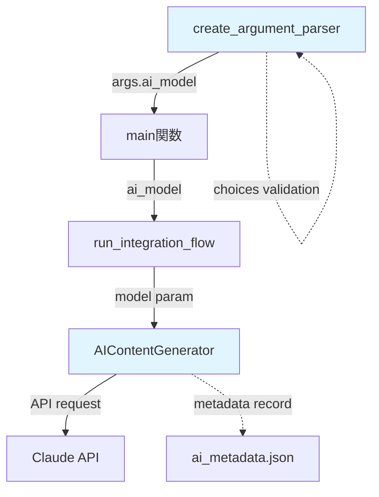
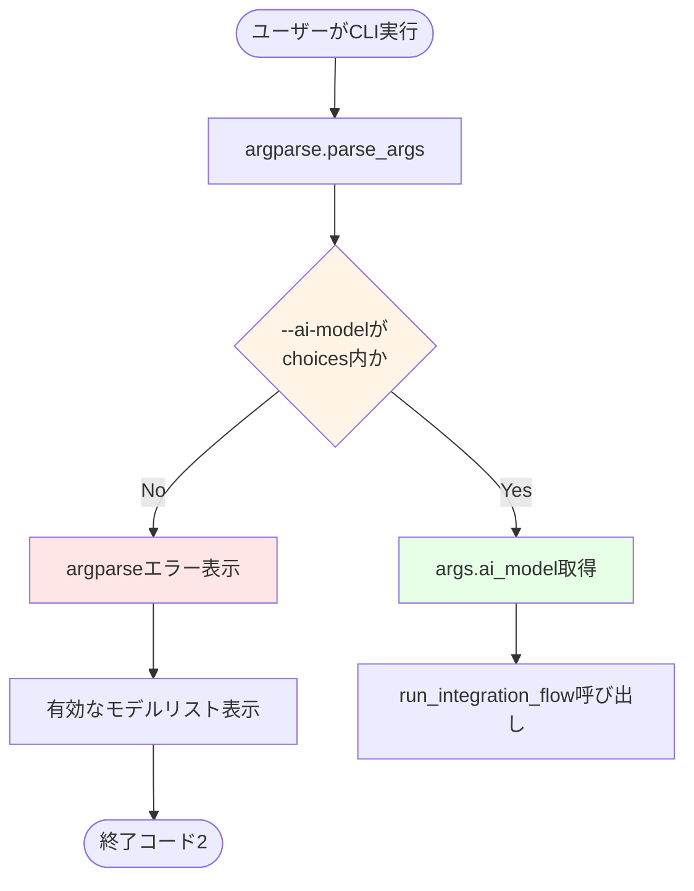
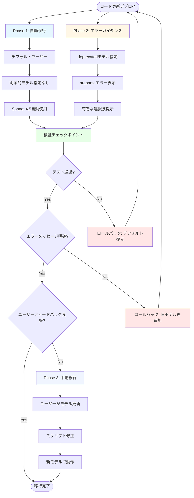

# 設計書: AIモデルアップグレード

## Overview

本機能は、deprecatedとなったClaude AIモデルを最新の推奨モデルに更新し、ユーザーが用途に応じて3段階のモデル（高速・安価、安定・中庸、高精度・高価）を選択できるようにする。これにより、APIの安定性を確保しつつ、コスト・速度・品質のトレードオフに応じた柔軟な記事生成を実現する。

**Purpose**: Deprecated Claude 3.5 Sonnetモデル（`claude-3-5-sonnet-20241022`）を最新のClaude 4.5ファミリーに移行し、3つのモデル階層（Haiku 4.5、Sonnet 4.5、Opus 4.1）から選択可能にすることで、API廃止リスクを回避し、用途に応じた最適なコスト・性能バランスを提供する。

**Users**: アプリ操作動画から記事を生成するユーザー（開発者、マーケター、テクニカルライター）が、予算や品質要求に応じてAIモデルを選択し、AI記事生成機能（`--ai-article`オプション）を利用する際に活用する。

**Impact**: 既存の`AIContentGenerator`クラスおよび`create_argument_parser`関数の設定を変更。デフォルトモデルを`claude-3-5-sonnet-20241022`から`claude-sonnet-4-5-20250929`に更新し、`--ai-model`オプションの選択肢を3つの最新モデルに置き換える。

### Goals

- Claude API deprecation（2025年10月22日）に対応し、システムの継続的な動作を保証する
- 3段階のモデル選択肢（Haiku 4.5、Sonnet 4.5、Opus 4.1）を提供し、ユーザーがコスト・速度・品質のトレードオフを制御できるようにする
- デフォルトモデルとして安定・中庸なSonnet 4.5を設定し、明示的な選択なしで最適なバランスを提供する
- 既存のワークフローとテストケースの互換性を維持し、システム更新による影響を最小化する
- モデル情報の可視性を向上させ、ユーザーが使用モデルとコストを把握できるようにする

### Non-Goals

- AIContentGeneratorクラスの内部ロジック変更（リトライ、エラーハンドリング、品質検証）は対象外
- プロンプトテンプレートの最適化やカスタマイズ機能の追加は対象外
- 他のClaude APIオプション（Batch API、Prompt Caching）の統合は将来の検討事項
- モデル性能の詳細ベンチマークやコスト最適化アルゴリズムは対象外（ユーザーが手動選択）

## Architecture

### Existing Architecture Analysis

現在のAI記事生成機能は以下のアーキテクチャで実装されている:

**CLI層**:
- `create_argument_parser()`: argparseで`--ai-model`オプションを定義し、choices制約で有効なモデルを限定
- `main()`: 引数をパースし、`run_integration_flow()`に渡す
- 現在のdefault: `'claude-3-5-sonnet-20241022'`
- 現在のchoices: `['claude-3-5-sonnet-20241022', 'claude-sonnet-4-20250514']`

**統合層**:
- `run_integration_flow()`: `ai_model`パラメータを受け取り、`AIContentGenerator`に渡す
- パラメータの変換や検証は行わず、受け取った値をそのまま転送

**AI生成層**:
- `AIContentGenerator.__init__(model: str)`: モデル名をインスタンス変数として保持
- `AIContentGenerator.generate_article()`: Claude API呼び出し時にモデル名を使用
- Anthropic Python SDK (`anthropic.Anthropic`)を使用してAPI通信
- メタデータ（`ai_metadata.json`）にモデル名を記録

**制約事項**:
- モデル名はCLI引数パーサーのchoicesで事前検証（無効な値は起動時にエラー）
- モデル名はそのままClaude APIに渡される（SDK側でさらに検証）
- 環境変数`ANTHROPIC_API_KEY`による認証は変更なし

**既存パターンの尊重**:
- argparseのchoices制約によるバリデーションパターンを維持
- モデル名のstring型での直接受け渡しパターンを維持
- エラーメッセージによるユーザーガイダンスパターンを維持

### High-Level Architecture

本機能は既存のアーキテクチャを変更せず、設定値の更新のみを行う:



**Architecture Integration**:
- **Existing patterns preserved**: argparseのchoices制約、string型モデル名、メタデータ記録、エラーメッセージング
- **New components rationale**: 新規コンポーネントは不要、既存設定の値のみ更新
- **Technology alignment**: Anthropic Python SDK（既存）がすべての新モデルをサポート（追加依存なし）
- **Steering compliance**: シングルファイル構造維持、型安全性（str型アノテーション継続）、下位互換性確保

### Technology Alignment

本機能は既存の技術スタックに完全に適合し、新規依存は不要:

**Claude API統合**:
- 使用SDK: `anthropic` Python package（既存）
- SDK version: 最新版はすべての新モデルをサポート（claude-sonnet-4-5-20250929、claude-haiku-4-5-20251001、claude-opus-4-1-20250805）
- 認証: `ANTHROPIC_API_KEY`環境変数（変更なし）
- API endpoint: Messages API（変更なし）

**新規導入依存**: なし（既存の`anthropic`パッケージで対応可能）

**既存パターンからの逸脱**: なし（設定値の更新のみ）

#### Key Design Decisions

##### Decision 1: argparse choices制約によるモデル検証

**Decision**: CLI引数パーサーのchoicesパラメータで有効なモデル名を明示的に限定し、無効な値を起動時に拒否する。

**Context**: ユーザーが誤ったモデル名を指定した場合、Claude API呼び出し時（記事生成処理の最後）に初めてエラーが発生すると、時間（スクリーンショット抽出、音声認識など）が無駄になる。

**Alternatives**:
1. **Runtime validation**: API呼び出し時にモデル名を検証し、エラー時に詳細なメッセージを表示
2. **No validation**: ユーザーが任意の文字列を指定可能にし、APIエラーをそのまま表示
3. **Config file validation**: 設定ファイルで有効なモデルリストを管理

**Selected Approach**: argparseのchoicesパラメータで事前検証（既存パターン継続）

```python
parser.add_argument('--ai-model', type=str,
                   default='claude-sonnet-4-5-20250929',
                   choices=[
                       'claude-haiku-4-5-20251001',
                       'claude-sonnet-4-5-20250929',
                       'claude-opus-4-1-20250805'
                   ],
                   help='使用するClaudeモデル（デフォルト: claude-sonnet-4-5-20250929）'
                        '\n  - haiku: 高速・安価（$1/$5 per MTok）'
                        '\n  - sonnet: 安定・中庸（$3/$15 per MTok、推奨）'
                        '\n  - opus: 高精度・高価（$15/$75 per MTok）')
```

**Rationale**:
- **Fail Fast**: 無効な値を起動時に即座に検出し、処理開始前にエラー通知
- **User Guidance**: argparseが自動生成するエラーメッセージで有効な選択肢を明示
- **Consistency**: 既存の`--model-size`（Whisper）と同じバリデーションパターンを使用

**Trade-offs**:
- **Gain**: 早期エラー検出、自動補完のヒント提供、コード変更最小化
- **Sacrifice**: 新モデル追加時にコード修正が必要（設定外部化なし）、ただし頻度は低い（年1-2回程度）

##### Decision 2: デフォルトモデルとしてSonnet 4.5を選択

**Decision**: `--ai-model`オプションのデフォルト値を`claude-sonnet-4-5-20250929`（安定・中庸モデル）に設定。

**Context**: ユーザーがモデルを明示的に指定しない場合、システムはデフォルトモデルで記事を生成する。最適なバランス（コスト、速度、品質）を提供するモデルを選ぶ必要がある。

**Alternatives**:
1. **Haiku 4.5**: 最安価・高速だが、品質が劣る可能性
2. **Sonnet 4.5**: 中庸のコスト・品質バランス
3. **Opus 4.1**: 最高品質だが、高コスト（5倍）

**Selected Approach**: Sonnet 4.5をデフォルトに設定

**Rationale**:
- **Anthropic推奨**: Model Deprecationsドキュメントで`claude-sonnet-4-5-20250929`が明示的に推奨移行先として記載
- **バランス**: $3/$15 per MTokは、記事生成（長文出力）において実用的なコストと高品質のバランス
- **既存ユーザー期待**: 現在のデフォルト（Sonnet 3.5）と同等のティア（中庸モデル）を維持

**Trade-offs**:
- **Gain**: 品質とコストのバランス、公式推奨に準拠、既存ユーザー体験の継続性
- **Sacrifice**: コスト重視ユーザーは明示的に`--ai-model claude-haiku-4-5-20251001`を指定する必要あり

##### Decision 3: モデル情報の標準出力表示とメタデータ記録

**Decision**: AI記事生成開始時に使用モデル名を標準出力に表示し、`ai_metadata.json`の`"model"`フィールドに記録する（既存パターン継続）。

**Context**: ユーザーがどのモデルで記事が生成されたか、またトークン使用量からコストを把握できるようにする必要がある。

**Alternatives**:
1. **Silent execution**: モデル名を表示せず、メタデータのみに記録
2. **Detailed cost display**: API呼び出し後にトークン使用量と推定コストをリアルタイム表示
3. **Log file only**: 標準出力ではなくログファイルに記録

**Selected Approach**: 既存パターン（標準出力 + メタデータJSON）を継続

```python
# AIContentGenerator.generate_article() 内
print(f"Generating AI article with model: {self.model}...")

# ai_metadata.json 内
{
    "model": "claude-sonnet-4-5-20250929",
    "usage": {
        "input_tokens": 1234,
        "output_tokens": 5678
    },
    ...
}
```

**Rationale**:
- **Visibility**: ユーザーが実行時にモデル名を即座に確認可能
- **Traceability**: メタデータファイルで後からコスト分析可能（トークン数 × 価格）
- **Consistency**: 既存のログ出力パターン（スクリーンショット抽出、音声認識）と統一

**Trade-offs**:
- **Gain**: 透明性、監査可能性、既存コードとの一貫性
- **Sacrifice**: リアルタイムコスト表示なし（ユーザーが手動計算）、ただし追加実装の複雑性を回避

## System Flows

### CLI Argument Processing Flow

モデル選択の検証とエラーハンドリングフロー:



**Error Message Example** (argparse auto-generated):
```
usage: extract_screenshots.py [-h] -i INPUT [--ai-model {claude-haiku-4-5-20251001,claude-sonnet-4-5-20250929,claude-opus-4-1-20250805}]
extract_screenshots.py: error: argument --ai-model: invalid choice: 'claude-3-5-sonnet-20241022' (choose from 'claude-haiku-4-5-20251001', 'claude-sonnet-4-5-20250929', 'claude-opus-4-1-20250805')
```

## Requirements Traceability

| Requirement | Summary | Components | Interfaces | Notes |
|------------|---------|-----------|-----------|-------|
| 1.1 | デフォルトモデル更新 | `create_argument_parser` | `--ai-model` default値 | `claude-sonnet-4-5-20250929` |
| 1.2 | モデル明示なしでSonnet 4.5使用 | `AIContentGenerator.__init__` | `model` parameter | デフォルト値の伝播 |
| 1.3 | Deprecatedモデル指定時エラー | argparse | choices制約 | 起動時エラー + ガイダンス表示 |
| 2.1 | 3段階モデル選択 | `create_argument_parser` | `--ai-model` choices | Haiku/Sonnet/Opus |
| 2.2 | 無効モデル指定時エラー | argparse | choices制約 | 自動エラーメッセージ |
| 2.3 | 指定モデルでAPI呼び出し | `AIContentGenerator.generate_article` | `self.model` | Claude APIに渡す |
| 3.1 | 開始時モデル名表示 | `AIContentGenerator.generate_article` | stdout | `print(f"Generating with {model}...")` |
| 3.2 | メタデータにモデル名記録 | `AIContentGenerator.generate_article` | `ai_metadata.json` | `"model"` key |
| 3.3 | メタデータ構造 | JSON schema | `{"model": str}` | 既存フォーマット継続 |
| 3.4 | ヘルプメッセージ | argparse | `--help` 出力 | 各モデル特性説明 |
| 4.1 | オプション省略時動作 | `create_argument_parser` | default値 | Sonnet 4.5使用 |
| 4.2 | 既存テスト互換性 | Test suite | - | モデル名更新で継続動作 |
| 4.3 | CLI構造維持 | argparse | 引数名・順序 | 変更なし |
| 4.4 | 環境変数認証 | `AIContentGenerator.__init__` | `ANTHROPIC_API_KEY` | 変更なし |
| 5.1-5.4 | ドキュメント更新 | README.md | - | 別タスクで対応 |

## Components and Interfaces

### CLI Layer

#### create_argument_parser()

**Responsibility & Boundaries**:
- **Primary Responsibility**: コマンドライン引数の定義と検証を行い、ユーザー入力をパースする
- **Domain Boundary**: CLI/UI層、ユーザー入力の受付とバリデーション
- **Data Ownership**: 引数定義（choices、default、help）、パーサー設定
- **Transaction Boundary**: 単一関数実行、状態を持たない

**Dependencies**:
- **Inbound**: `main()`関数から呼び出される
- **Outbound**: argparse標準ライブラリ
- **External**: なし

**Contract Definition**:

**Service Interface**:

```python
def create_argument_parser() -> argparse.ArgumentParser:
    """
    コマンドライン引数パーサーを作成

    Returns:
        argparse.ArgumentParser: 設定済み引数パーサー

    Postconditions:
        - --ai-modelオプションのdefaultが'claude-sonnet-4-5-20250929'
        - --ai-modelのchoicesが3つの最新モデルを含む
        - helpメッセージに各モデルの特性（コスト・速度・品質）が記載
    """
```

**Preconditions**: なし（純粋関数）

**Postconditions**:
- 返されるArgumentParserは`--ai-model`オプションを含む
- `--ai-model`のdefaultは`'claude-sonnet-4-5-20250929'`
- `--ai-model`のchoicesは`['claude-haiku-4-5-20251001', 'claude-sonnet-4-5-20250929', 'claude-opus-4-1-20250805']`
- helpテキストに各モデルの価格情報（$1/$5、$3/$15、$15/$75 per MTok）が含まれる

**Invariants**:
- choicesリストは常に3つの要素を持つ
- defaultはchoices内の値である

**Modified Configuration**:

```python
parser.add_argument('--ai-model', type=str,
                   default='claude-sonnet-4-5-20250929',  # UPDATED
                   choices=[  # UPDATED
                       'claude-haiku-4-5-20251001',
                       'claude-sonnet-4-5-20250929',
                       'claude-opus-4-1-20250805'
                   ],
                   help='使用するClaudeモデル（デフォルト: claude-sonnet-4-5-20250929）\n'
                        '  - haiku-4-5: 高速・安価（$1/$5 per MTok）\n'
                        '  - sonnet-4-5: 安定・中庸（$3/$15 per MTok、推奨）\n'
                        '  - opus-4-1: 高精度・高価（$15/$75 per MTok）')
```

**Integration Strategy**:
- **Modification Approach**: 既存のadd_argument呼び出しのdefaultとchoicesパラメータのみ変更
- **Backward Compatibility**: 引数名（`--ai-model`）、型（str）、オプション順序は維持
- **Migration Path**: 既存スクリプトは自動的にSonnet 4.5を使用（明示的モデル指定がある場合はエラー表示で移行ガイダンス）

### Integration Layer

#### run_integration_flow()

**Responsibility & Boundaries**:
- **Primary Responsibility**: スクリーンショット抽出、音声認識、AI記事生成の統合フローを実行
- **Domain Boundary**: オーケストレーション層、各コンポーネント間の調整
- **Data Ownership**: フロー実行状態、中間データの受け渡し
- **Transaction Boundary**: 全処理ステージをまとめた単一トランザクション

**Dependencies**:
- **Inbound**: `main()`から呼び出される
- **Outbound**: `ScreenshotExtractor`, `AudioProcessor`, `TimestampSynchronizer`, `MarkdownGenerator`, `AIContentGenerator`
- **External**: ファイルシステム（出力ディレクトリ）

**Contract Definition**:

**Service Interface**:

```python
def run_integration_flow(
    video_path: str,
    output_dir: str,
    audio_path: Optional[str],
    markdown: bool,
    ai_article: bool,
    app_name: Optional[str],
    ai_model: str,  # MODEL PARAMETER (no logic change)
    output_format: str,
    model_size: str,
    threshold: int,
    interval: float,
    count: int
) -> None:
    """
    統合処理フローを実行

    Args:
        ai_model: 使用するClaudeモデル名（argparseで検証済み）
        （他のパラメータは変更なし）

    Preconditions:
        - ai_modelはargparseのchoices制約を通過した有効な値

    Postconditions:
        - ai_articleがTrueの場合、ai_modelがAIContentGeneratorに渡される
        - AIContentGeneratorが指定モデルでClaude APIを呼び出す
    """
```

**Preconditions**:
- `ai_model`はargparseで検証済みの有効なモデル名

**Postconditions**:
- `ai_article=True`の場合、`AIContentGenerator`に`ai_model`が渡される
- モデル名は変換・検証なしでそのまま転送される

**Invariants**: なし（パラメータ受け渡しのみ）

**Integration Strategy**:
- **Modification Approach**: 既存コードの変更なし（パラメータ受け渡しのみ）
- **Backward Compatibility**: 関数シグネチャ、引数順序は完全に維持
- **Migration Path**: 既存の呼び出しコードは無変更で動作

### AI Content Generation Layer

#### AIContentGenerator

**Responsibility & Boundaries**:
- **Primary Responsibility**: Claude APIを使用してマルチモーダル記事を生成し、品質検証とメタデータ記録を行う
- **Domain Boundary**: AI記事生成ドメイン、外部API統合
- **Data Ownership**: API設定（モデル、トークン数）、生成記事、メタデータ
- **Transaction Boundary**: 記事生成リクエストごとの単一トランザクション

**Dependencies**:
- **Inbound**: `run_integration_flow()`から呼び出される
- **Outbound**: `PromptTemplateManager`, `QualityValidator`, `anthropic.Anthropic` (Claude API)
- **External**: Anthropic Claude API（Messages API）、環境変数（`ANTHROPIC_API_KEY`）

**External Dependencies Investigation**:

**Anthropic Python SDK**:
- **Official Documentation**: https://docs.anthropic.com/en/api/client-sdks
- **GitHub Repository**: https://github.com/anthropics/anthropic-sdk-python
- **Minimum Required Version**: `anthropic>=0.43.0` （Claude 4.5ファミリーをサポート）
- **Implementation Note**: `requirements.txt`に`anthropic>=0.43.0`を明記し、CI/CD環境でバージョンチェックを実施
- **Model Support**: すべてのClaude 4.xモデルをサポート（claude-sonnet-4-5-20250929、claude-haiku-4-5-20251001、claude-opus-4-1-20250805）
- **API Signature**: `client.messages.create(model=str, max_tokens=int, messages=List[Dict])` - 変更なし
- **Authentication**: 環境変数`ANTHROPIC_API_KEY`またはコンストラクタ引数 - 変更なし
- **Rate Limits**: Tier-dependent（Standard: 50 req/min）、`RateLimitError`例外で通知
- **Breaking Changes**: なし（model文字列のみ変更、APIインターフェースは同一）
- **Known Issues**: なし（公式推奨モデル）

**Contract Definition**:

**Service Interface**:

```python
class AIContentGenerator:
    def __init__(self,
                 output_dir: str,
                 api_key: Optional[str] = None,
                 model: str = "claude-sonnet-4-5-20250929",  # UPDATED DEFAULT
                 max_tokens: int = 4000) -> None:
        """
        Args:
            model: 使用するClaudeモデル名（デフォルト: claude-sonnet-4-5-20250929）
            （他のパラメータは変更なし）

        Preconditions:
            - modelは有効なClaude APIモデル識別子（argparseで事前検証済み）

        Postconditions:
            - self.modelにモデル名が保存される
            - Anthropicクライアントが初期化される
        """

    def generate_article(self,
                        synchronized_data: List[Dict],
                        app_name: str = "アプリ",
                        output_format: str = "markdown") -> Dict[str, any]:
        """
        スクリーンショット・メタデータ・音声文字起こしから高品質記事を生成

        Args:
            synchronized_data: タイムスタンプ同期済みデータ
            app_name: アプリ名
            output_format: 出力形式

        Returns:
            {
                "content": str,
                "metadata": {
                    "model": str,  # 使用したモデル名（例: "claude-sonnet-4-5-20250929"）
                    "usage": {"input_tokens": int, "output_tokens": int},
                    ...
                }
            }

        Preconditions:
            - self.modelが有効なモデル識別子
            - ANTHROPIC_API_KEYが設定済み

        Postconditions:
            - 標準出力にモデル名が表示される
            - ai_metadata.jsonの"model"フィールドにself.modelが記録される
            - 生成記事がai_article.mdに保存される
        """
```

**Preconditions**:
- `model`パラメータは有効なClaude API識別子（choices制約で保証）
- 環境変数`ANTHROPIC_API_KEY`が設定済み

**Postconditions**:
- `self.model`にモデル名が保存される
- `generate_article()`実行時に標準出力にモデル名表示
- `ai_metadata.json`の`"model"`フィールドに使用モデル名が記録される

**Invariants**:
- `self.model`は初期化後不変
- API呼び出し時に`self.model`がそのまま使用される

**Integration Strategy**:
- **Modification Approach**: `__init__`のdefaultパラメータのみ変更（ロジック変更なし）
- **Backward Compatibility**: コンストラクタシグネチャ、メソッド定義は完全に維持
- **Migration Path**: 既存のテストコードは`model`引数を明示的に渡すため無影響、未指定の場合は新デフォルト（Sonnet 4.5）を使用

## Data Models

**Note**: モデル名とその特性は、argparseのchoicesリストとhelpテキストに直接記述します。追加のマッピングデータ構造やenumクラスは実装しません（シンプル優先）。

モデル情報（参考）:
- `claude-haiku-4-5-20251001`: 高速・安価（$1/$5 per MTok）
- `claude-sonnet-4-5-20250929`: 安定・中庸（$3/$15 per MTok、推奨デフォルト）
- `claude-opus-4-1-20250805`: 高精度・高価（$15/$75 per MTok）

### Data Contracts & Integration

#### CLI to Integration Layer

**Argument Object** (argparse.Namespace):

```python
{
    # 既存フィールド
    "input": str,
    "output": str,
    "count": int,
    "threshold": int,
    "interval": float,
    "audio": Optional[str],
    "markdown": bool,
    "model_size": str,
    "ai_article": bool,
    "app_name": Optional[str],
    "output_format": str,

    # 更新フィールド
    "ai_model": str  # 新しいデフォルト: "claude-sonnet-4-5-20250929"
                     # 有効な値: ["claude-haiku-4-5-20251001",
                     #           "claude-sonnet-4-5-20250929",
                     #           "claude-opus-4-1-20250805"]
}
```

**Validation Rules**:
- argparseのchoices制約で自動検証
- 無効な値は起動時に拒否（exit code 2）

**Serialization Format**: Pythonオブジェクト（dict属性アクセス）

#### AI Metadata Output

**ai_metadata.json Schema**:

```json
{
    "model": "claude-sonnet-4-5-20250929",
    "prompt_version": "v1.0",
    "generated_at": "2025-10-19T12:34:56Z",
    "total_screenshots": 10,
    "transcript_available": true,
    "quality_score": 0.85,
    "usage": {
        "input_tokens": 1234,
        "output_tokens": 5678
    },
    "validation": {
        "has_h1": true,
        "h2_count": 3,
        "min_length": true,
        "has_image_refs": true
    }
}
```

**Schema Versioning Strategy**: 既存フィールド維持、新規フィールド追加は下位互換（オプショナル）

**Backward Compatibility**: `"model"`フィールドの値のみ変更、他のフィールド構造は不変

## Error Handling

### Error Strategy

本機能のエラーハンドリングは既存の2層構造を維持:

1. **CLI Validation Layer** (argparse): 起動時に無効なモデル名を拒否
2. **API Execution Layer** (AIContentGenerator): Claude API呼び出し時のエラーハンドリング（既存）

### Error Categories and Responses

#### User Errors (CLI Input)

**Invalid Model Name** (argparse validation failure):

```
Trigger: python extract_screenshots.py -i video.mp4 --ai-model invalid-model
Error Type: argparse.ArgumentError
Exit Code: 2
Message:
  usage: extract_screenshots.py [-h] --ai-model {claude-haiku-4-5-20251001,claude-sonnet-4-5-20250929,claude-opus-4-1-20250805}
  extract_screenshots.py: error: argument --ai-model: invalid choice: 'invalid-model'
  (choose from 'claude-haiku-4-5-20251001', 'claude-sonnet-4-5-20250929', 'claude-opus-4-1-20250805')

Recovery: ユーザーは有効なモデル名を指定して再実行
Mitigation: argparseが自動的に有効な選択肢をリスト表示
```

**Deprecated Model Name** (旧モデル指定):

```
Trigger: python extract_screenshots.py -i video.mp4 --ai-model claude-3-5-sonnet-20241022
Error Type: argparse.ArgumentError
Exit Code: 2
Message: 同上（invalid choiceエラー）

Recovery: ヘルプメッセージを参照し、新しいモデルを選択
Guidance: README.mdにモデル移行ガイドを記載（Requirement 5.1）
```

#### System Errors (API Execution)

**API Authentication Error** (既存エラーハンドリング継続):

```
Trigger: ANTHROPIC_API_KEY未設定またはAPI key無効
Error Type: ValueError (初期化時) または anthropic.AuthenticationError (API呼び出し時)
Exit Code: 1
Message: "ANTHROPIC_API_KEY environment variable is not set..." または API error details

Recovery: 環境変数を設定して再実行
Mitigation: 初期化時の事前チェック（既存）
```

**Rate Limit Error** (既存リトライロジック継続):

```
Trigger: API rate limit超過
Error Type: anthropic.RateLimitError
Handling: 指数バックオフリトライ（最大3回、既存実装）
Message: "Rate limit exceeded. Retrying in X seconds..."

Recovery: 自動リトライ、失敗時は一時的に待機して再実行
Mitigation: リトライロジック（既存）
```

**Model Not Found Error** (API側検証、低確率):

```
Trigger: Claude APIがモデルを認識しない（SDKバージョン不一致など）
Error Type: anthropic.APIError (400 Bad Request)
Message: API error details（例: "model not found"）

Recovery: anthropicパッケージを最新版に更新（pip install --upgrade anthropic）
Mitigation: argparseのchoices制約で事前防止（公式ドキュメント検証済みモデルのみ）
```

### Monitoring

**既存のモニタリング継続**:
- 標準出力: モデル名、トークン使用量、エラーメッセージ
- `ai_metadata.json`: モデル名、トークン数、品質スコア、検証結果
- エラーログ: Claude API例外のスタックトレース（標準エラー出力）

**追加モニタリング（推奨、実装オプショナル）**:
- モデル別の平均トークン使用量（将来のコスト分析用）
- モデル選択頻度（ユーザー行動分析用）

## Testing Strategy

### Unit Tests

**test_create_argument_parser.py** (既存テストの更新):

```python
def test_ai_model_default_updated():
    """
    Given: create_argument_parser()を呼び出す
    When: デフォルト引数でパースする
    Then: args.ai_modelが'claude-sonnet-4-5-20250929'である
    """

def test_ai_model_choices_updated():
    """
    Given: create_argument_parser()を呼び出す
    When: --ai-model オプションの定義を確認する
    Then: choicesが['claude-haiku-4-5-20251001', 'claude-sonnet-4-5-20250929', 'claude-opus-4-1-20250805']である
    """

def test_ai_model_haiku_valid():
    """
    Given: create_argument_parser()を呼び出す
    When: --ai-model claude-haiku-4-5-20251001 を指定する
    Then: パースが成功し、args.ai_modelが'claude-haiku-4-5-20251001'である
    """

def test_ai_model_sonnet_valid():
    """
    Given: create_argument_parser()を呼び出す
    When: --ai-model claude-sonnet-4-5-20250929 を指定する
    Then: パースが成功し、args.ai_modelが'claude-sonnet-4-5-20250929'である
    """

def test_ai_model_opus_valid():
    """
    Given: create_argument_parser()を呼び出す
    When: --ai-model claude-opus-4-1-20250805 を指定する
    Then: パースが成功し、args.ai_modelが'claude-opus-4-1-20250805'である
    """

def test_ai_model_deprecated_rejected():
    """
    Given: create_argument_parser()を呼び出す
    When: --ai-model claude-3-5-sonnet-20241022 を指定する
    Then: argparse.ArgumentErrorが発生し、有効な選択肢が表示される
    """

def test_ai_model_invalid_rejected():
    """
    Given: create_argument_parser()を呼び出す
    When: --ai-model invalid-model を指定する
    Then: argparse.ArgumentErrorが発生し、有効な選択肢が表示される
    """

def test_ai_model_help_includes_pricing():
    """
    Given: create_argument_parser()を呼び出す
    When: --ai-model オプションのhelpテキストを取得する
    Then: 各モデルの価格情報（$1/$5、$3/$15、$15/$75）が含まれる
    """
```

**test_ai_content_generator.py** (既存テストの更新):

```python
def test_default_model_updated():
    """
    Given: AIContentGeneratorをデフォルト引数で初期化する
    When: モデル名を確認する
    Then: self.modelが'claude-sonnet-4-5-20250929'である
    """

def test_haiku_model_initialization():
    """
    Given: AIContentGeneratorをmodel='claude-haiku-4-5-20251001'で初期化する
    When: モデル名を確認する
    Then: self.modelが'claude-haiku-4-5-20251001'である
    """

def test_sonnet_model_initialization():
    """
    Given: AIContentGeneratorをmodel='claude-sonnet-4-5-20250929'で初期化する
    When: モデル名を確認する
    Then: self.modelが'claude-sonnet-4-5-20250929'である
    """

def test_opus_model_initialization():
    """
    Given: AIContentGeneratorをmodel='claude-opus-4-1-20250805'で初期化する
    When: モデル名を確認する
    Then: self.modelが'claude-opus-4-1-20250805'である
    """

def test_generate_article_uses_specified_model(mock_anthropic):
    """
    Given: AIContentGeneratorをmodel='claude-haiku-4-5-20251001'で初期化する
    When: generate_article()を呼び出す（モックAPI）
    Then: Claude API呼び出しのmodelパラメータが'claude-haiku-4-5-20251001'である
    """

def test_metadata_includes_model_name(mock_anthropic):
    """
    Given: AIContentGeneratorでgenerate_article()を実行する
    When: ai_metadata.jsonを読み込む
    Then: "model"フィールドが使用したモデル名と一致する
    """

def test_stdout_displays_model_name(capsys, mock_anthropic):
    """
    Given: AIContentGeneratorでgenerate_article()を実行する
    When: 標準出力をキャプチャする
    Then: "Generating AI article with model: claude-sonnet-4-5-20250929"が含まれる
    """
```

### Integration Tests

**test_cli_integration.py** (既存テストの更新):

```python
def test_default_model_end_to_end(tmp_path):
    """
    Given: --ai-modelオプションなしでCLIを実行する
    When: AI記事生成を実行する（モックAPI）
    Then: ai_metadata.jsonの"model"が'claude-sonnet-4-5-20250929'である
    """

def test_haiku_model_end_to_end(tmp_path):
    """
    Given: --ai-model claude-haiku-4-5-20251001 でCLIを実行する
    When: AI記事生成を実行する（モックAPI）
    Then: ai_metadata.jsonの"model"が'claude-haiku-4-5-20251001'である
    """

def test_opus_model_end_to_end(tmp_path):
    """
    Given: --ai-model claude-opus-4-1-20250805 でCLIを実行する
    When: AI記事生成を実行する（モックAPI）
    Then: ai_metadata.jsonの"model"が'claude-opus-4-1-20250805'である
    """

def test_deprecated_model_cli_error():
    """
    Given: --ai-model claude-3-5-sonnet-20241022 でCLIを実行する
    When: argparseが引数をパースする
    Then: exit code 2で終了し、エラーメッセージに有効な選択肢が表示される
    """
```

### E2E Tests (Manual)

**実際のClaude API呼び出しテスト**（CI環境では実行しない、開発者が手動実行）:

```bash
# Haiku 4.5でAI記事生成
python extract_screenshots.py -i test_video.mp4 --ai-article --ai-model claude-haiku-4-5-20251001
# 検証: ai_metadata.jsonの"model"がhaiku、トークン使用量が記録されている

# Sonnet 4.5でAI記事生成（デフォルト）
python extract_screenshots.py -i test_video.mp4 --ai-article
# 検証: ai_metadata.jsonの"model"がsonnet

# Opus 4.1でAI記事生成
python extract_screenshots.py -i test_video.mp4 --ai-article --ai-model claude-opus-4-1-20250805
# 検証: ai_metadata.jsonの"model"がopus、高品質な記事が生成される

# 非推奨モデルでエラー確認
python extract_screenshots.py -i test_video.mp4 --ai-article --ai-model claude-3-5-sonnet-20241022
# 検証: エラーメッセージに有効な3つのモデルがリストされる
```

### Performance Tests

**パフォーマンステストは不要**（既存のAI記事生成ロジックは変更なし、モデル名の文字列変更のみ）

ただし、各モデルの性能特性（参考情報）:
- **Haiku 4.5**: Sonnet 4比2倍以上の速度（公式発表）
- **Sonnet 4.5**: 中庸の速度（既存Sonnet 3.5と同等）
- **Opus 4.1**: 高品質だが低速（Sonnet比1.5-2倍の処理時間）

## Security Considerations

**既存のセキュリティ対策を継続**:

1. **API Key管理**: 環境変数`ANTHROPIC_API_KEY`で管理、コードにハードコードしない
2. **Input Validation**: argparseのchoices制約で無効なモデル名を事前拒否
3. **Error Message Sanitization**: API keyをエラーメッセージに含めない（既存実装で対応済み）

**新規セキュリティ考慮事項**: なし（モデル名の文字列変更のみ、認証・通信・データ処理ロジックは不変）

## Migration Strategy

本機能は既存ユーザーへの影響を最小化する段階的移行を想定:



### Migration Phases

#### Phase 1: 自動移行（デフォルトユーザー）

**対象**: `--ai-model`オプションを指定していない既存ユーザー

**Process**:
1. コード更新をデプロイ
2. デフォルト値が自動的に`claude-sonnet-4-5-20250929`に変更
3. 次回実行時、新しいモデルで記事生成

**Validation**:
- 既存のテストスイートを実行（`python -m unittest discover -s . -p "test_*.py" -v`）
- すべてのテストが通過することを確認
- サンプル動画でE2Eテストを実行し、ai_metadata.jsonの"model"がSonnet 4.5であることを確認

**Rollback Trigger**:
- テストが失敗する
- 生成記事の品質が著しく低下する

**Rollback Procedure**:
```python
# create_argument_parser() in extract_screenshots.py
parser.add_argument('--ai-model', type=str,
                   default='claude-3-5-sonnet-20241022',  # REVERT
                   choices=['claude-3-5-sonnet-20241022', 'claude-sonnet-4-20250514'],  # REVERT
                   ...)
```

#### Phase 2: エラーガイダンス（明示的モデル指定ユーザー）

**対象**: スクリプトやCI/CDで`--ai-model claude-3-5-sonnet-20241022`を明示的に指定しているユーザー

**Process**:
1. ユーザーが既存のコマンドを実行
2. argparseがエラーメッセージを表示（有効な3つのモデルをリスト）
3. README.mdのMigration Guideを参照してモデル名を更新

**Error Message Example**:
```
extract_screenshots.py: error: argument --ai-model: invalid choice: 'claude-3-5-sonnet-20241022'
(choose from 'claude-haiku-4-5-20251001', 'claude-sonnet-4-5-20250929', 'claude-opus-4-1-20250805')
```

**Validation**:
- エラーメッセージが明確で有効な選択肢を提示している
- README.mdに移行ガイドが記載されている（Requirement 5.1）
- ユーザーがエラーメッセージから移行先モデルを判断できる

**Rollback Trigger**:
- エラーメッセージが不明瞭で移行方法が分からない
- ユーザーから多数の問い合わせが発生する

**Rollback Procedure**:
- choicesとdefaultを旧設定に完全復元（Phase 1と同じロールバック手順）
```python
# create_argument_parser() in extract_screenshots.py
parser.add_argument('--ai-model', type=str,
                   default='claude-3-5-sonnet-20241022',  # REVERT
                   choices=['claude-3-5-sonnet-20241022', 'claude-sonnet-4-20250514'],  # REVERT
                   ...)
```

#### Phase 3: 手動移行（ユーザーアクション）

**対象**: すべての明示的モデル指定ユーザー

**Process**:
1. ユーザーがスクリプト・CI設定を更新
2. 旧モデル → 新モデルに置き換え
   - `claude-3-5-sonnet-20241022` → `claude-sonnet-4-5-20250929`（同等ティア）
   - または`claude-haiku-4-5-20251001`（コスト削減）、`claude-opus-4-1-20250805`（品質優先）
3. 動作確認後、移行完了

**Migration Guide** (README.mdに記載):
```markdown
### Model Migration Guide

Claude 3.5 Sonnet（`claude-3-5-sonnet-20241022`）は2025年10月22日に廃止されました。以下のモデルに移行してください:

| 旧モデル | 推奨移行先 | 特性 |
|---------|----------|------|
| claude-3-5-sonnet-20241022 | claude-sonnet-4-5-20250929 | 同等の品質・コストバランス（推奨） |
| claude-3-5-sonnet-20241022 | claude-haiku-4-5-20251001 | コスト削減（約1/3）、高速 |
| claude-3-5-sonnet-20241022 | claude-opus-4-1-20250805 | 品質優先、高コスト（5倍） |

**Before:**
```bash
python extract_screenshots.py -i video.mp4 --ai-article --ai-model claude-3-5-sonnet-20241022
```

**After:**
```bash
python extract_screenshots.py -i video.mp4 --ai-article --ai-model claude-sonnet-4-5-20250929
```
```

**Validation**:
- ユーザーから移行完了報告
- エラー率の低下（argparseエラーが減少）
- ai_metadata.jsonで新モデルの使用が確認される

**Rollback Trigger**: なし（Phase 3はユーザー主導、システム側はサポートのみ）

### Validation Checkpoints

**Checkpoint 1: テスト通過**
- 実行: `python -m unittest discover -s . -p "test_*.py" -v`
- 基準: すべてのテストケースが合格（FAIL 0、ERROR 0）
- 失敗時: Phase 1ロールバック

**Checkpoint 2: エラーメッセージ明確性**
- 実行: `python extract_screenshots.py -i video.mp4 --ai-model invalid-model`
- 基準: エラーメッセージに3つの有効なモデルがリストされる
- 失敗時: Phase 2ロールバック

**Checkpoint 3: E2E動作確認**
- 実行: 実際のClaude APIでHaiku/Sonnet/Opusの記事生成
- 基準: すべてのモデルで正常に記事生成、ai_metadata.jsonに正しいモデル名記録
- 失敗時: 調査と修正（SDKバージョン確認、API互換性確認）

**Checkpoint 4: ユーザーフィードバック**
- 実行: 初期ユーザーグループでテスト（社内、ベータテスター）
- 基準: エラー報告なし、移行ガイドが理解可能
- 失敗時: ドキュメント改善またはPhase 2ロールバック

### Timeline

- **Day 0**: コード更新デプロイ（Phase 1自動移行）
- **Day 0-1**: Validation Checkpoint 1-3実行
- **Day 1-7**: Phase 2エラーガイダンス期間（ユーザーが移行開始）
- **Day 7-30**: Phase 3手動移行期間（ユーザーが順次移行）
- **Day 30**: 移行完了確認、旧モデルchoicesから完全削除（オプショナル）

**注**: 2025年10月22日（Claude 3.5 Sonnet廃止日）より前にPhase 1-2を完了することが推奨される。
